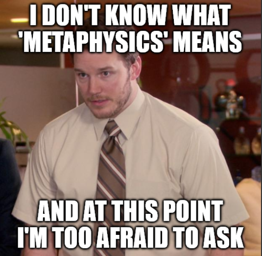
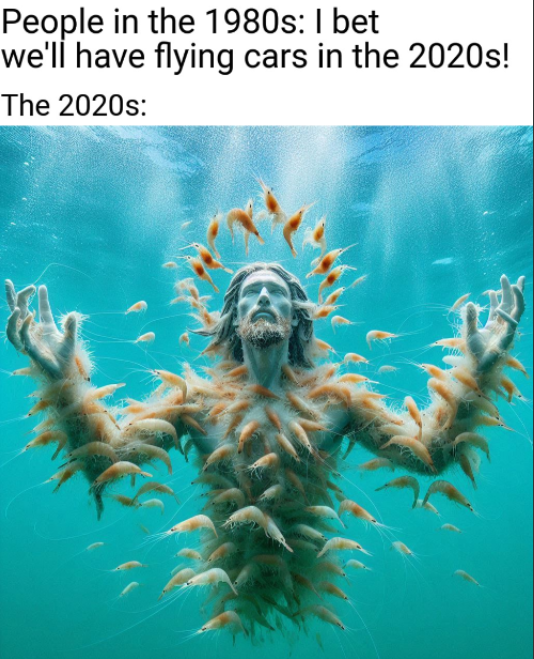
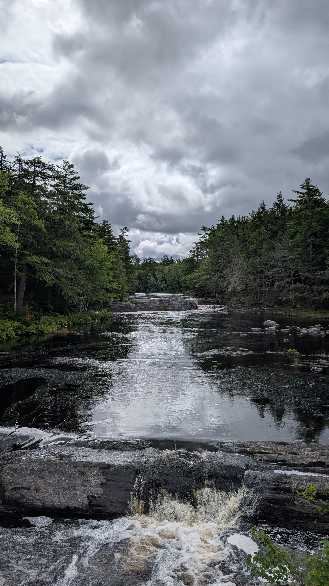

If there was one book that I kept seeing in various reading recommendations, it was the *Zen and the Art of Motorcycle Maintenance* by Robert M. Pirsig. At first, I kind of ignored it. Then, I kept seeing and hearing about this book all over the internet. I was like "Ok, I will add this to my reading list". Eventually, it got to the point where this book was being described as an 'all time classic' which made me go "Ok, I have to read it NOW."

I kept wondering "What is it about this book?" Over the summer, I finally decided to give it a go and find out makes it an 'all time classic'.

The general synopsis of this book is about Pirsig and his son Chris who embark on a motorcycle trip from Minnesota to Northern California along with their close friends John and Sylvia Sutherland. Throughout the journey, Pirsig explores various philosophical discussions on various topics including the history of philosophy, epistemology and the philosophy of science. I have to admit it's quite a dense read and I'll probably have to reread it again a couple of times to fully grasp some of these topics.

But if there's one thing that Pirsig keeps talking about, it's the concept of *Quality*. His discussions into *Quality* started a whole new branch of Metaphysics (again, another word that I keep hearing about but still don't know what it means) called the Metaphysics of Quality (MOQ). I won't even bother trying to explain words like 'Metaphysics' and *'Quality'* because I don't even know what they mean. Ironically, even Pirsig does not define *Quality* in the book. For instance, check out this excerpt:

> *Quality … you know what it is, yet you don’t know what it is. But that’s self-contradictory. But some things* are *better than others, that is, they have more quality. But when you try to say what the quality is, apart from the things that have it, it all goes* poof! *There’s nothing to talk about. But if you can’t say what Quality is, how do you know what it is, or how do you know that it even exists? If no one knows what it is, then for all practical purposes it doesn’t exist at all. But for all practical purposes it really* does *exist.*
>
> I think there is such a thing as Quality, but that as soon as you try to define it, something goes haywire. You can’t do it.
>
> But then, below the definition on the blackboard, he wrote, “But even though Quality cannot be defined, you know what Quality is!” and the storm started all over again.



Despite a lack of clear definition for *Quality* in Pirsig's discussions, there was something about this word that resonated with me.

One of my favorite parts from the book is Phaedrus (Pirsig's fictional alter ego) attempting to define *Quality* using realism.

> His answer was an old one belonging to a philosophic school that called itself realism. "A thing exists,” he said, “if a world without it can’t function normally. If we can show that a world without Quality functions abnormally, then we have shown that Quality exists, whether it’s defined or not.” He thereupon proceeded to subtract Quality from a description of the world as we know it.
>
> The first casualty from such a subtraction, he said, would be the fine arts. If you can’t distinguish between good and bad in the arts they disappear. There’s no point in hanging a painting on the wall when the bare wall looks just as good. There’s no point to symphonies, when scratches from the record or hum from the record player sound just as good.
>
> Poetry would disappear, since it seldom makes sense and has no practical value. And interestingly, comedy would vanish too. No one would understand the jokes, since the difference between humor and no humor is pure Quality.
>
> Next he made sports disappear. Football, baseball, games of every sort would vanish. The scores would no longer be a measurement of anything meaningful, but simply empty statistics, like the number of stones in a pile of gravel. Who would attend them? Who would play?
>
> Next he subtracted Quality from the marketplace and predicted the changes that would take place. Since quality of flavor would be meaningless, supermarkets would carry only basic grains such as rice, cornmeal, soybeans and flour; possibly also some ungraded meat, milk for weaning infants and vitamin and mineral supplements to make up deficiencies. Alcoholic beverages, tea, coffee and tobacco would vanish. So would movies, dances, plays and parties. We would all use public transportation. We would all wear G.I. shoes.
>
> A huge proportion of us would be out of work, but this would probably be temporary until we relocated in essential non-Quality work. Applied science and technology would be drastically changed, but pure science, mathematics, philosophy and particularly logic would be unchanged.
>
> Phædrus found this last to be extremely interesting. The purely intellectual pursuits were the least affected by the subtraction of Quality. If Quality were dropped, only rationality would remain unchanged. That was odd. Why would that be?
>
> He didn’t know, but he did know that by subtracting Quality from a picture of the world as we know it, he’d revealed a magnitude of importance of this term he hadn’t known was there. The world can function without it, but life would be so dull as to be hardly worth living. In fact it wouldn’t be worth living. The term worth is a Quality term. Life would just be living without any values or purpose at all.
>
> He looked back over the distance this line of thought had taken him and decided he’d certainly proved his point. Since the world obviously doesn’t function normally when Quality is subtracted, Quality exists, whether it’s defined or not.
>
> After conjuring up this vision of a Qualityless world, he was soon attracted to its resemblance to a number of social situations he had already read about. Ancient Sparta came to mind, Communist Russia and her satellites. Communist China, the Brave New World of Aldous Huxley and the 1984 of George Orwell. He also remembered people from his own experience who would have endorsed this Qualityless world.

As I was reading through the examples of a *Quality*-less world in the last paragraph, I was reminded of current state of affairs in the world of AI. AI slop is all around us. As Olivia Whang mentioned in the article [*Can you get Rich Quick off AI Slop?*](https://www.nytimes.com/interactive/2026/06/01/magazine/ai-slop-viral-videos.html)*,* "there's comedy slop, literary slop, art slop, niche slop, slop for kids, political slop — but the substance of slop always matters less than the fact that you’re looking at it."



The more I think about Pirsig's *Quality*, the more I am starting to understand the current outrage against AI slop. But what is it about AI slop that makes it repugnant to the masses and is antithetical to *Quality*?

First let us define what slop means. According to [Merriam-Webster's Dictionary](https://www.merriam-webster.com/dictionary/slop), slop is defined as:

> Digital content of low quality that is produced usually in quantity by means of artificial intelligence.

*Low quality.* Those are the keywords that stand out. We know that artificial content can be easily mass produced. But that doesn't answer the question "Why is it not *Quality*?"

Later I found out that I was barking at the wrong tree. Instead of asking myself the characteristics of low *Quality* work, I should ask myself what constitutes as *Quality*? When I think of *Quality*, I equate it with words like 'good', 'excellence', 'craftsmanship'. In the *Zen and the Art of Motorcycle Maintenance*, Phaedrus attempts to single out aspects of *Quality* such as unity, vividness, authority, economy, sensitivity, clarity, emphasis, flow, suspense, brilliance, precision, proportion, depth. But then again, they are equally hard to define.

So I thought why not look at something that would be considered as *Quality*? I was reminded of Robert A. Caro's works such as *The Power Broker* and his four volumes of *The Years of Lyndon Johnson*.

A while back, I came across *Working* by Robert A. Caro. Caro is dubbed as one the greatest living biographers because of his influential works such as *The Power Broker*, a biography of New York's urban planner Robert Moses and four volumes of *The Years of Lyndon Johnson.* *Working* is about the process Caro went through to produce those works. I thought maybe there is something over there that can illustrate what it takes to create *Quality.*

Caro's work centers around the political power. Whether it is describing how Robert Mosses amassed more power than any mayor or governor in New York's history or Lyndon Johnson's ascension from rural Texas to the Oval Office in Washington D.C.; what makes Caro's works special is his ability to make the reader visualize the physical setting in which a book’s action is occurring.

When Caro started working on his biographies of Johnson, Caro thought that it would be a piece of cake. There were already seven biographies written three years after Johnson passed away. These biographies portrayed Johnson as a hero from the Hill Country who came from humble beginnings and rose through the ranks in Capitol Hill. Caro thought that all he would have to do was interview the people that knew Johnson to fill in some additional details and he would have himself a biography on Lyndon Johnson.

However, as he started doing these interviews in rural Hill Country, the process was turning out to be more difficult than he anticipated. Turns out the rural folk in Hill Country led a totally different lifestyle from the city dwelling journalists. Hill Country folk were not accustomed to long conversations with strangers. If someone did manage to get a hold of them, at best, they would regurgitate the same facts that everyone knew about Johnson: that he was young, ambitious and cared about winning. At worst, they would simply refuse to elaborate and that would be it.

Eventually, Caro and his wife moved to the Hill Country and lived there for three years. Needless to say, things started changing for Caro. Now, people from the Hill Country started sharing details about Johnson that were never shared with the 'portable journalists'.

To understand someone as complex as Lyndon Johnson, you have to understand the circumstances he grew up in. Johnson grew up on the Johnson Ranch, an isolated place in rural Texas. Through his interactions with Sam Houston Johnson, Lyndon Johnson's little brother, Caro found out that the two boys would sit on a fence for hours when they were little hoping that a rider or carriage would come by so they’d have a new person to talk to. Not only that, but Johnson's mother, Rebekah was also inflicted by her own share of loneliness which definitely rubbed on a young Johnson.

It's one thing to write about how loneliness shaped a young Johnson but how do you make a reader *feel* that loneliness? That's when Caro decided to spend a whole day alone in the hills. This helped him get a sense of that loneliness and put it in words.

> When Rebekah walked out the front door of that little house, there was nothing—a roadrunner streaking behind some rocks with something long and wet dangling from his beak, perhaps, or a rabbit disappearing around a bush so fast that all she really saw was the flash of a white tail—but otherwise nothing. There was no movement except for the ripple of the leaves in the scattered trees, no sound except for the constant whisper of the wind…. If Rebekah climbed, almost in desperation, the hill in back of the house, what she saw from its crest was more hills, an endless vista of hills, hills on which there was visible not a single house … hills on which nothing moved, empty hills with, above them, empty sky; a hawk circling silently overhead was an event. But most of all, there was nothing human, no one to talk to.

Similarly, it was through interactions with Sam Houston that Caro was able to understand Johnson's complicated relationship with his father. As Sam Houston said "The most important thing for Lyndon was not to be like Daddy.”

Sam Ealy Houston, was an idealistic man. He always wanted to restore the great 'Johnson Ranch'. However, in an attempt to restore the ranch, Sam Johnson went broke and lost the ranch. Eventually, the Johnson family had to move to Johnson City. Things took a downturn for the Johnson family. Sam Ealy Houston became a laughing stock of the town and was constantly plagued with illness. A young Lyndon Johnson grew up in an environment where food was hard to come by and he was in constant fear of the bank taking away their house. Clearly this upbringing shaped Johnson's personality as a President. For instance, when Henry 'Scoop' Jackson, who served with Johnson as senator and under the presidencies of both John Kennedy and Johnson, was asked to describe the differences between the two presidents, he said that Kennedy would use his charm to get the votes. Johnson, on the other hand, would go to the ends of the earth to get the vote because what mattered to him was winning. As Caro found out, Texas Hill Country was a very unforgivable place and consequences of the slightest mistake were unsurmountable. Johnson had witnessed those consequences firsthand which explains why he couldn't afford to lose.

During Caro's time at the Hill Country, he also found out about the impoverished conditions the women of the Hill Country were living in. These women used to carry gallons of water on wooden yokes for miles because there was no electricity. It makes sense why Lyndon Johnson was instrumental in bringing electricity to rural areas under the Rural Electrification Administration (REA) which changed the lives of those women. But we only get to appreciate the significance of this initiative because someone like Caro was able to witness the hardships the women in the Hill Country and then write about it.

That's when it started to hit me why Caro's works are an embodiment of *Quality.* There have been numerous biographies written on Lyndon Johnson. But what seperated his works from others was not just what he wrote but the lengths he went to find the Truth. It's those interviews and intensive research that showed us a side of Lyndon Johnson that we all understand today. It's the time and effort he put in to make the reader resonate with the words. That is *Quality.*

This brings me to my next point about one of the other precursors about *Quality:* care. Think of any piece of *Quality* work (or let's just replace *Quality* with 'exceptional' if you are still having a hard time understand what the word means). Think of any piece of exceptional work. It can be Da Vinci's *Lady with an Ermine,* Shakespeare's *King Lear,* a dish from a three Michelin star restaurant or something that is close to you like a great project that you completed. What's the common ingredient across all these examples?

Care.

Brad Stulberg describes it succintly in his book *The Way of Excellence*

> The best athletes care deeply.\
> The best artists care deeply.\
> The best leaders care deeply.\
> The best coaches care deeply.\
> The best teachers care deeply.\
> The best doctors care deeply.\
> The best writers care deeply.\
> The best scientists care deeply.\
> The best parents care deeply.
>
> Caring deeply is the cost of admission to a big and textured life.

Caring is what compels someone to put in the time and effort to produce *Quality.* When we care deeply about something or someone, whether it's our loved ones, our friends , family, community, society; we are willing to give it our all because anything short of that is not *Quality.* That's why I think, care, or lack thereof, is what separates AI slop from *Quality*.

Recently Paul Graham, co-founder of Y Combinator called out the AI-written emails he was receiving in his inbox

```{=html}
<p><blockquote class="twitter-tweet"><p lang="en" dir="ltr">A lot of the emails I get from founders are now written in a hard-hitting journalistic style. I know they're written by AI, because no founder ever wrote this way before. And once you realize something is written by AI, it's hard not to ignore it.</p>&mdash; Paul Graham (@paulg) <a href="https://x.com/paulg/status/2058844147092488401?ref_src=twsrc%5Etfw">May 25, 2026</a></blockquote> <script async src="https://platform.x.com/widgets.js" charset="utf-8"></script></p> 
```

Graham further added that he stops reading the email the moment he suspects it's AI generated. I kind of see his position on this issue. He views these emails as an inability to communicate independently. If you, as a founder, can't even bother to spend some time articulating your thoughts, how can you expect someone else to care about it? The purpose of writing is to simulate our thoughts and express our ideas. As Cal Newport puts it, "writing is calisthenics for your brain" and it is supposed to be hard. However, if I just pawn off someone else's ideas, I failed at the task. If I actually cared, I wouldn't be content with handing off a bunch of facts from Wikipedia.

It would be akin to going a three Michelin star restaurant and the waiter serving you a bag of Doritos for the main course. What makes the fining dining experience *Quality* is the simple fact that the chef cares deeply about his ingredients, his craft, his fellow employees, his guests, his community and so on. If the waiter were to bring a bag of Doritos to my table, that would indicate that the chef does not care about me and therefore, in my eyes, this experience is not *Quality.*

So where does that leave us with AI and *Quality*? Whether we hate it or like it, AI is here to stay and I still do think it is going to be an integral part of our lives. My hope is that AI will help us enhance *Quality*, whatever that term entails in this digital age. Who knows, maybe in a world of AI slop, creating *Quality* work would be treasured even more? However, if there is one thing I learned going down this rabbit hole, it is that *Quality* is an essence of our experience. Yes, it's that same human experience that continues to pollute rivers, wage wars and drive inequalities. But just like how depths of winter makes us appreciate the warmth of spring, similarly our experiences, good or bad, makes us appreciate *Quality.* All the arts, sciences, inventions, cultures are a by product of the human experience. Ironically, creation of AI is a testament to the human ingenuity. While we have done a great job of building something that is an amalgam of our experiences, it would be a mistake to assume AI is THE EXPERIENCE. As I said earlier, It can certainly help us enhance THE EXPERIENCE but to say AI in itself is *Quality* is to undermine our human imagination, creativity, innovation, empathy, sympathy, love, compassion, healing, and forgiveness.

To say AI is *Quality* is to undermine the human experience.

{alt="Quality I got to experience at the Keimkujik National Park earlier this yea" width="613" height="828"}
