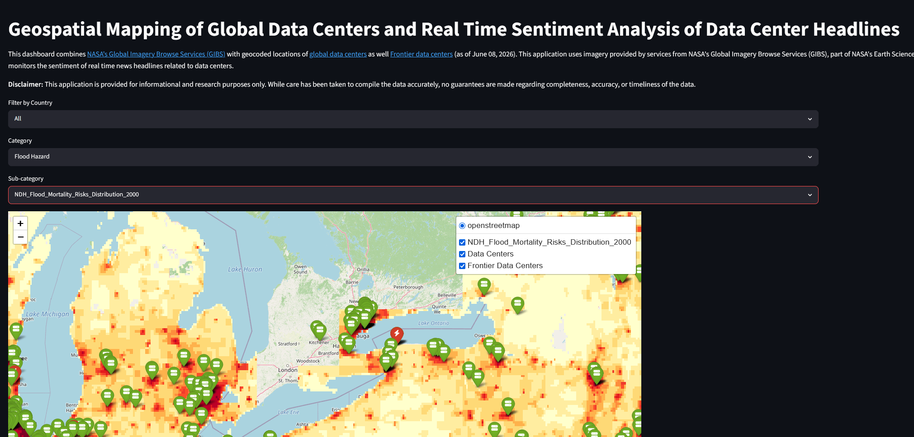
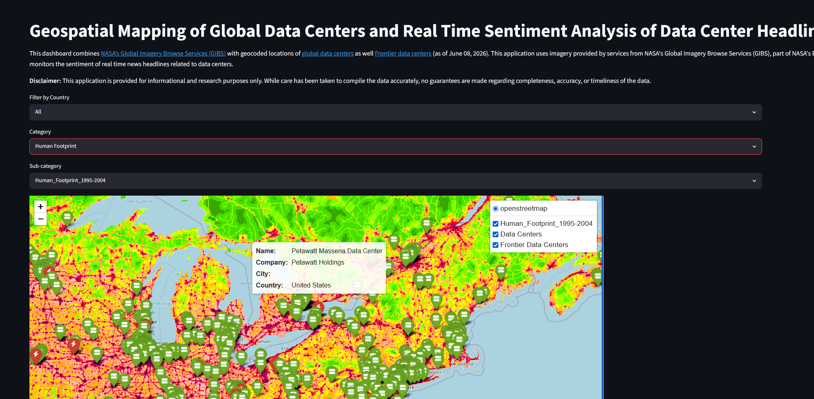
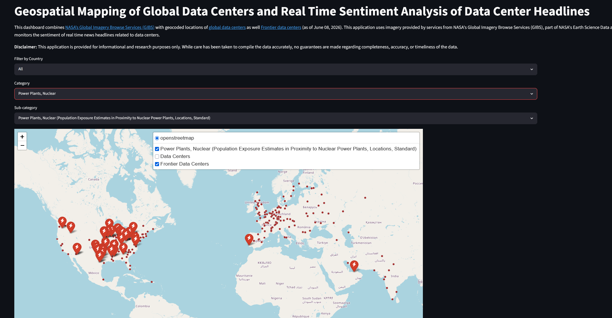
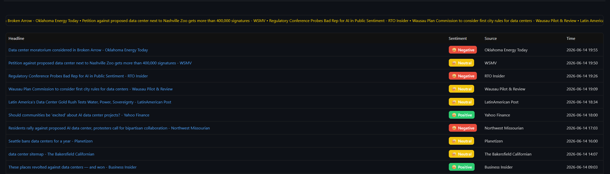
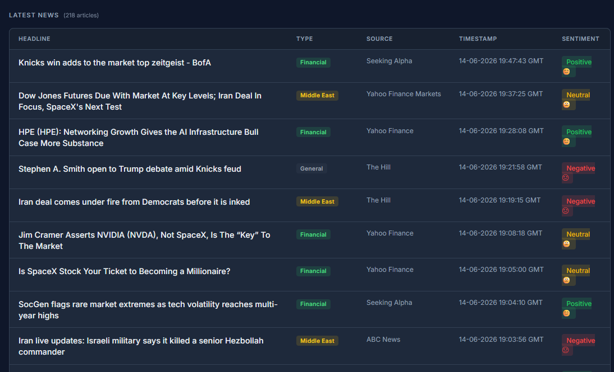

If you have been following the news lately, data centers are something everyone is talking about. One of the themes in these data center related headlines is around the environmental and social impacts of data centers. There is a legitimate concern from various stakeholders on how these massive data centers that are being built across the world are going to have an impact on the energy grid, local communities, resources and the surrounding flora and fauna.

So I thought to myself, what if there was an easy way for a user to visualize and overlay different variables like flood risk, population density on top of the geolocations of data centers around the world?

Only if someone had done something similar.

Geospatial Mapping...

Physical Risks....

WAIT A MINUTE!

```{=html}
<p><iframe src="https://giphy.com/embed/lOyJPEs8x9tuwgalEi" width="480" height="480" style="" frameBorder="0" class="giphy-embed" allowFullScreen></iframe><p><a href="https://giphy.com/gifs/digitelco-digi-digilah-digigifs-lOyJPEs8x9tuwgalEi">via GIPHY</a></p></p>
```

Few months back, I [created](https://geomapcanadianfinance.streamlit.app/) this web application to visualize and understand the impacts of climate change variables on the Canadian branches of different banks using NASA’s WMS capabilities. I [wrote](https://aryamik.github.io/posts/Geospatial%20Mapping%20of%20the%20Canadian%20Financial%20Sector/) about this multi-year journey about creating that web application and how it was something near and dear to me. If you recall, I mentioned that the application can be leveraged for a wide variety of use cases that extend beyond Canadian banking.

Here we are six months later with a very relevant use case - data centers. Best part? I don't have to reinvent the wheel. So do I get to take credit for myself?

```{=html}
<p><iframe src="https://giphy.com/embed/9ioJ6rzqXfl1S" width="480" height="266" style="" frameBorder="0" class="giphy-embed" allowFullScreen></iframe><p><a href="https://giphy.com/gifs/jean-ralphio-saperstein-9ioJ6rzqXfl1S">via GIPHY</a></p></p>
```

The only difference this time was that I had to find the geocoded locations of global data centers. Unlike, the geocoded locations of Canadian banks, that wasn't a big hassle. One quick search and I was able to find this amazing dataset compiled by [Ringmastr4](https://github.com/Ringmast4r/Global-Data-Center-Map/tree/main). What was even great was that there was a GeoJSON layer available! All I had to was plug in the layer to the existing WMS layers on my application.

Just like in the previous application, the user can simply select the appropriate WMS layers to visualize the different impacts. Here is a snippet showing Flood Mortality Risks.



Similarly, here is a snippet with Human Footprint.



Then I decided why not take it one step further and add the locations of some of these frontier data centers? [Epoch AI](https://epoch.ai/data/data-centers?view=graph&tab=power) provides this data publicly. Since it only included the addresses of these AI data centers, I had to geocode these using ArcGIS. But that wasn't too much hassle either because I was able to leverage the same script (shoutout to [EthanHicks1](https://www.youtube.com/watch?v=tKtDZ_-GuBo)!) that I used to geocode the bank locations.

Here is a snippet showing the locations of frontier data centers along with Nuclear Power Plants layer.



Then I thought why not create a news dashboard of some sorts? So I decided to use Google News' RSS to search for headlines with the keywords 'data center' and then I put them through VADER sentiment analysis to get a rough sentiment of headlines. Granted sentiment analysis has its own limitations, but given the current public sentiment towards data centers, I thought it would be a good addition to the dashboard.

{width="886"}

[](https://github.com/ShaonINT/breaking_news_market_sentiment)

Here is the link for the [application](https://geomapping-of-global-data-centers.streamlit.app/).
