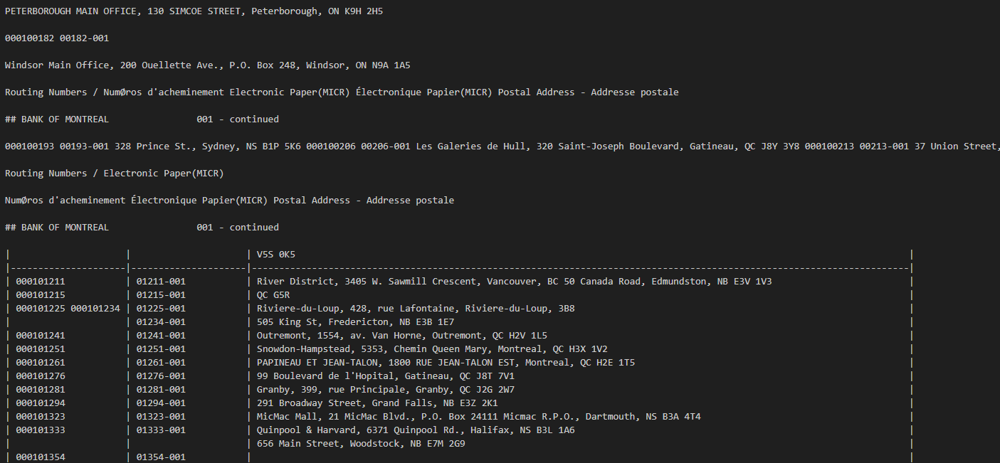
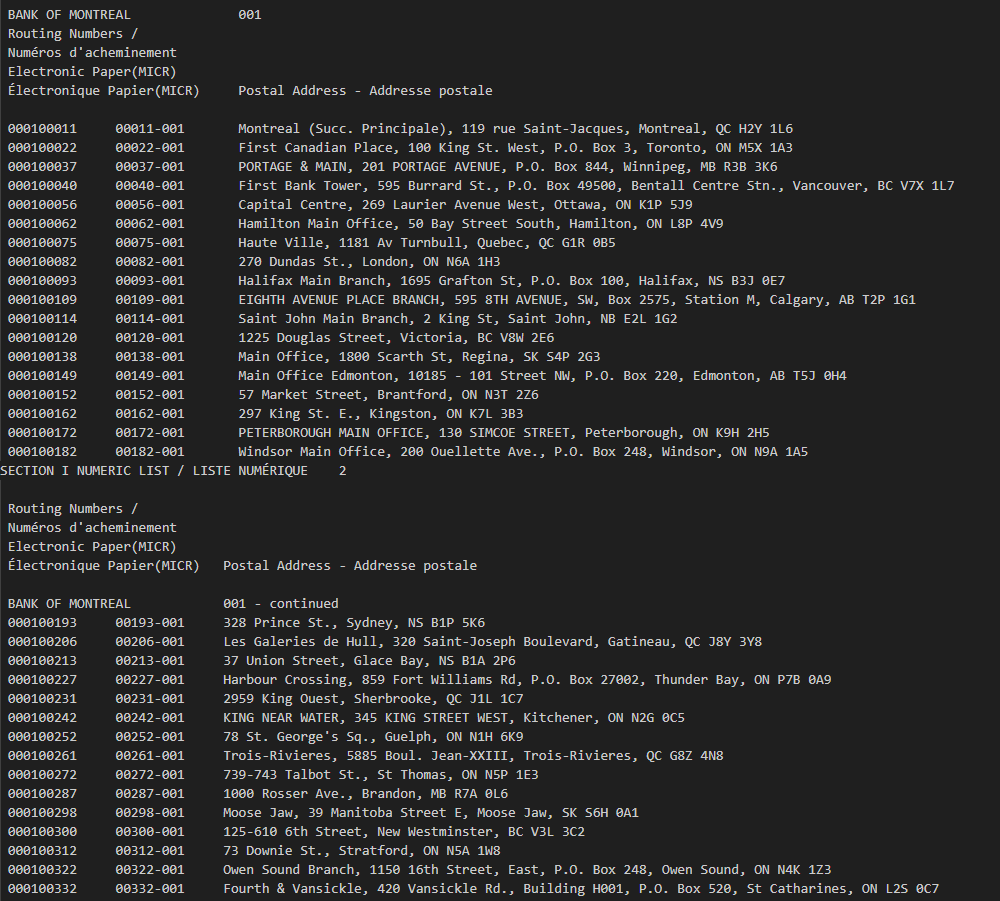
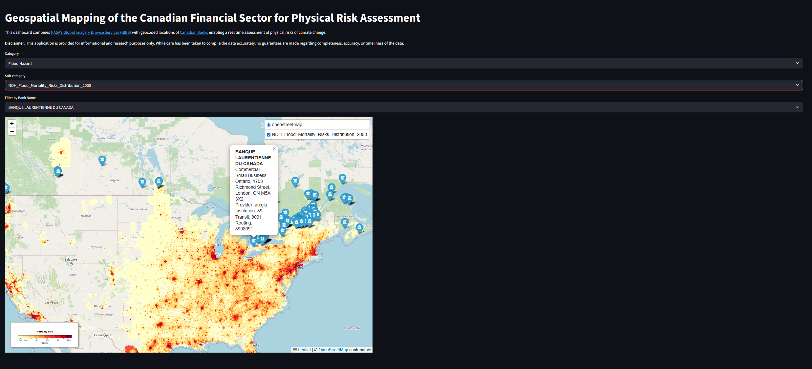
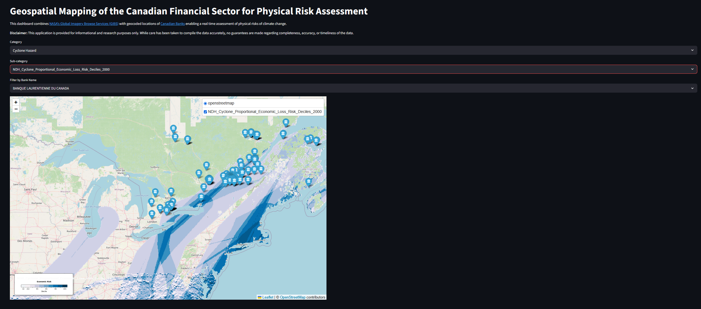
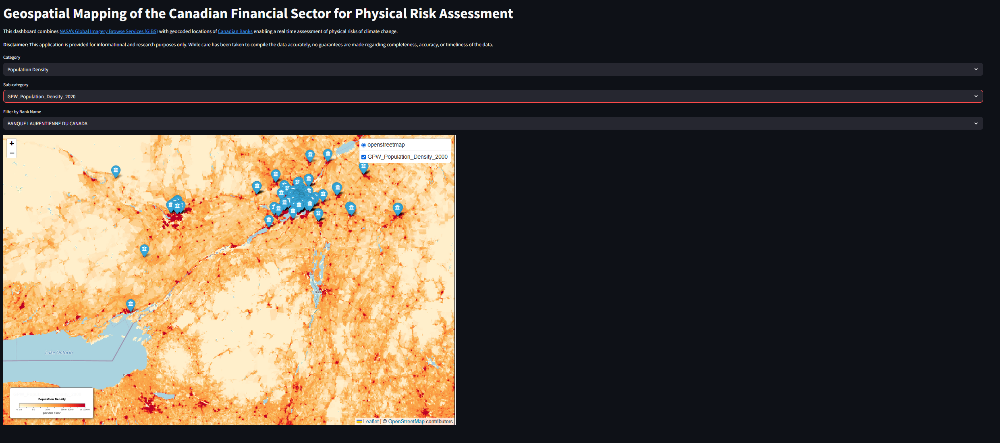
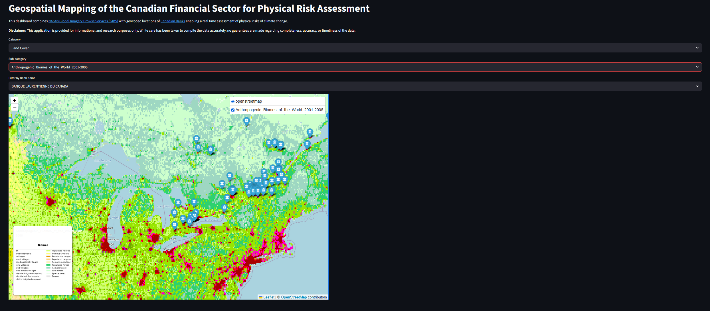
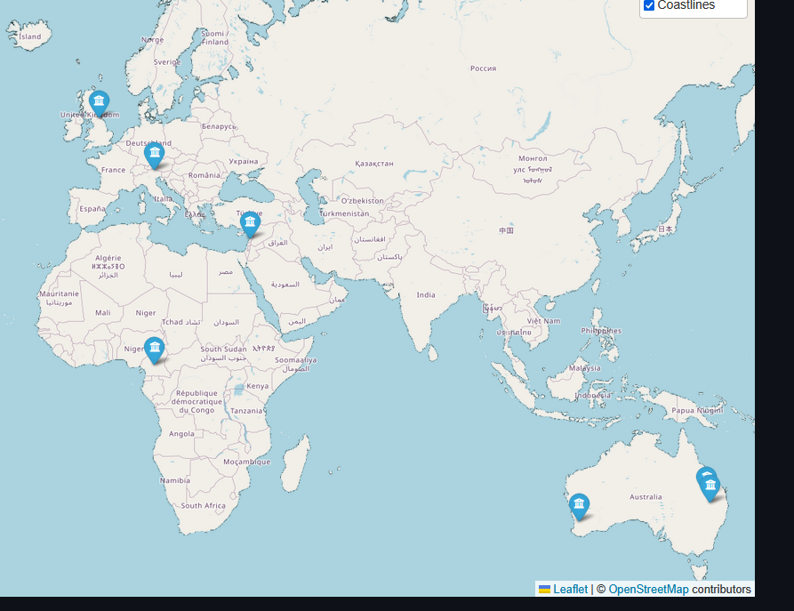

It's story time.

It was early 2019. A young Aryamik had just wrapped up his 1B term at University of Waterloo where one of the courses he took was introductory statistics. He became fascinated with the idea of the world of analytics and different applications in the environmental sector. One day he was casually browsing the internet and he stumbled across a [report](https://www.unepfi.org/industries/banking/navigating-a-new-climate-assessing-credit-risk-and-opportunity-in-a-changing-climate/) titled 'Navigating a New Climate: Assessing Credit Risk and Opportunity in a Changing Climate' by UNEPFI. In the report, he saw a case study where TD used Bloomberg's \<MAPS\> function for assessing the physical risks of climate change on their lending portfolio. That young Aryamik became fascinated with the interplay of how physical risks can be analysed.

A couple of years later, when Aryamik finally got his hands on a Bloomberg Terminal, the first function he entered in the search bar was \<MAPS\> (duh). And the rest as they say is history.


For some reason, the idea of physical risks and analysing the real world impacts has always fascinated me. Needless to say, I always wanted to do something *akin* to what \<MAPS\> function allows users to do - overlay and analyze multiple datasets; bringing together geographic data on projected climate change impacts. Afters years and years of pondering over what that would look like, I finally have something to show for: A real time web application to visualize and understand the impacts of climate change variables on the Canadian branches of different banks using NASA's WMS capabilities.

But before we got into that, I think it's important to look at how I got the data in the first place because without it, none of this would had been possible.

A while back when I was noodling around with \<MAPS\>, I found out that there was a way to overlay different layers on top of locations of banks in the US. Upon further investigation, I found out that the Federal Deposit Insurance Corporation provides this [dataset](https://banks.data.fdic.gov/bankfind-suite/bankfind) that is updated on a weekly basis. I wanted to find something similar for the Canadian banks. Unfortunately, I couldn't find a FDIC-esque dataset even on Government of Canada's [Open Data Portal](https://search.open.canada.ca/opendata/?owner_org=osfi-bsif&page=1&sort=metadata_modified%20desc). Eventually, I literally searched for 'Canadian Banks Branch Locations' and the first result that showed up was from Payments Canada. Turns out, Payments Canada has a [Financial institutions branch directory (FIBD)](https://www.payments.ca/payment-resources/directories?field_directory_type=11) that provides routing numbers and addresses for branches of all Canadian financial institutions. The only caveat was that the data is provided in .pdf format. But atleast that is better than something. And besides, it's 2026 and we do have some amazing tools like LlamaParse that can allow us to extract data from complex documents.

So finally a plan was set in motion. As a first step, I would download the document and parse it to get a nice, clean looking dataset. FIBD has two formats for the addresses: a geographical list organized by municipality and a numerical list. Initially, I was leaning towards using the geographical list as I thought it was better suited for my purpose (geocoding addresses) as it is categorized by regions. But upon further inspection, I ended up using the numerical list primarily because it was categorized by banks which is something I wanted to have in the final dataset.

Then came the important part: parsing the document. I [recently used](https://aryamik.github.io/posts/Man's%20Search%20for%20Catastrophe%20Data/) docling for extracting natural disasters data from AON's reports and I was very happy with the results. So I had no reason to NOT use it again. Besides the contents of the FIBD seemed somewhat more structured compared to AON's reports.

``` python
from docling.document_converter import DocumentConverter

source = Data\2026-01-09-Banks_Numeric_List.pdf  
converter = DocumentConverter()
doc = converter.convert(source).document

print(doc.export_to_markdown()) 
```

For the first few pages, the markdown extracted was pretty accurate. However, somewhere around page 3, the format turned funky:

{width="740" height="281"}

I could have worked with it somehow but I realized the juice is not worth the squeeze. So I decided to try using LlamaParse this time.

``` python
import os

os.environ["LLAMA_CLOUD_API_KEY"] = "llx-"

from llama_parse import LlamaParse
import nest_asyncio
nest_asyncio.apply()

parser = LlamaParse()
result = parser.load_data(Data\2026-01-09-Banks_Numeric_List.pdf)
```

Much better and consistent results this time:



Goes on to show why I am still a huge fan of LlamaParse for parsing documents. Given that the markdown was consistent across the board, next step was simply extracting the data from the markdown and creating a pandas dataframe.

``` python
import pandas as pd
import re


header_pattern = re.compile(r"^(.*?)(\d{3})\s*$") #extracting the bank header names
row_pattern = re.compile(r"(\d{9})\s+(\d{5})-(\d{3})\s+(.*)") #extracting individual rows containing addresses

data = []
current_bank = None
current_inst = None

# A simple function that extracts dataset rows by first detecting bank's header and then rows containing the addresses

for doc in result:
    for line in doc.text.splitlines():
        line = line.strip()
        if not line:
            continue

        bank_match = bank_header_pattern.match(line)
        if bank_match:
            current_bank = bank_match.group(1).strip()
            current_inst = bank_match.group(2)
            continue

        data_match = data_row_pattern.match(line)
        if data_match:
            routing = data_match.group(1)
            transit = data_match.group(2)
            inst = data_match.group(3)
            address = data_match.group(4)

            rows.append({
                "bank_name": current_bank,
                "institution": inst,
                "transit": transit,
                "routing": routing,
                "address": address
            })

#converting the dataset into a pandas dataframe
df = pd.DataFrame(data)
df.head()
```

Atleast now I had an exhaustive dataset consisting of a bank's name, it's transit and routing numbers and most importantly the addresses. But it was far from over. I still needed the geocoordinates (i.e. latitudes and longitudes) of these addresses to effectively plot them.

This is where geocoding comes in. Simply put, [geocoding](https://en.wikipedia.org/wiki/Address_geocoding) is the process of taking a text-based description of a location, such as an address or the name of a place, and returning geographic coordinates (typically the latitude/longitude pair) to identify a location on the Earth's surface. I could talk at lengths about geocoding as honestly it is a domain in itself but for our purposes, I will just leave it by saying it is an art as much as it is a science. How you decide to geocode is going to vary your final results. I decided to use [geopy](https://geopy.readthedocs.io/en/stable/) for this task. Turns out there a whole bunch of geocoders available such as Google Maps, Bing Maps, Nominatim each with their own strengths and weaknesses. According to geopy's documentation:

> Each geolocation service you might use, such as Google Maps, Bing Maps, or
> Nominatim, has its own class in `geopy.geocoders` abstracting the service’s
> API. Geocoders each define at least a `geocode` method, for resolving a
> location from a string, and may define a `reverse` method, which resolves a
> pair of coordinates to an address. Each Geocoder accepts any credentials
> or settings needed to interact with its service, e.g., an API key or
> locale, during its initialization.

Now I will be completely honest. I had no idea what I was doing at this point. The examples in the documentation and other supporting tutorials were valid for a handful of addresses, not for around 15000 addresses! When I did try geocoding a large batch, I was hitting the rate limits of these API services. That was until I came across [this](https://youtu.be/tKtDZ_-GuBo) tutorial by EthanHicks1. He had created a Python script for batch geocoding large amounts of addresses using ArcGIS and Komoot. This is literally I wanted. So I ran the script as is and lo and behold I had my dataset with all the addresses and their geocoordinates. The only downside is it took nearly 8 hours for the script to run. My computer probably still hates me for this.

The only thing that was missing was having different layers that could be overlayed on top of these geocoordinates. But the million dollar question was "How would I do that?"

Turns out in the field of Geographic Information Systems (GIS), there is a standard protocol called [Web Map Service (WMS)](https://www.ogc.org/standards/wms/) for serving georeferenced map images over an application. Think of it this way - in order to plot a geographical data over an application, one would have to get a whole bunch of data (usually in a Raster and TIFF format), figure out a way to plot them accurately. That sounds like a computational nightmare. It takes too much resources and it's not very user friendly. Every time I want to plot something, I have to fetch this massive dataset and then process it. Now instead of this entire song and dance, what if the underlying data was readily available to be displayed by a simple request to a remote server hosting the underlying data? This renders a real time map of the geospatial data without any pre-defined and cached tiles.

As long as I could find an appropriate data source that allows WMS capabilities for different environmental and climate change related impacts, I should be all set. And if there is one trusted, reliable and authoritative resource that provides these capabilities, it has to be [NASA's Global Imagery Browse Services (GIBS)](https://nasa-gibs.github.io/gibs-api-docs/). According to GIBS documentation:

> NASA's Global Imagery Browse Services (GIBS) system provides
> visualizations of NASA Earth Science observations through standardized
> web services. These services deliver global, full-resolution
> visualizations of satellite data to users in a highly responsive manner,
> enabling visual discovery of scientific phenomena, supporting timely
> decision-making for natural hazards, educating the next generation of
> scientists, and making imagery of the planet more accessible to the
> media and public.

GIBS provides over 1000 visualizations representing visualized science data from the NASA Earth Observing System Data and Information System. I seriously doubt there is any other resource that is as comprehensive as GIBS. Can we just take a moment to appreciate the fact that we live in a time where we have all these capabilities at our fingertips? Think of the advantages from an emergency response perspective, disaster recovery, resiliency planning and data driven decision making.

Once that was done, all that was left to do was marry the geocoordinates with the WMS layers in a nicely packaged Streamlit app that allows users to select the relevant layers and visualize the footprint of a given bank.

So here is the moment you all have been waiting for:



Over here, we can see the 'Flood Mortality Risk' layer overlayed on top of branch locations for 'BANQUE LAURENTIENNE DU CANADA'. It looks like the flood mortality risk is concentrated around Ontario and Quebec. Something the risk managers would want to consider:

-   How are we ensuring operations in these high risk areas don't go down in an event of an extreme flood? Do we have adequate business continuity processes?

-   How would we ensure our customers living in these high risk areas have access to banking services in an event of an extreme flood?

-   Do we have the proper insurance coverage in the high risk areas?

Similarly, for 'Cyclone Hazard', we see that the economic risk is concentrated along the east coast.



What's great about GIBS is that it provides layers on other socio-economic variables that extend beyond environmental hazards and physical risks. For instance, 'Population Density' layer can provide some unique insights such as "Whether BANQUE LAURENTIENNE DU CANADA has operations in areas of low population density?" Customers that are located in remote areas might not have access to banking services within their immediate vicinity.



From a nature and biodiversity risk perspective, risk managers may find it useful to investigate the 'Land Cover' layers to see if they have any operations in biodiversity hotspots? Or even better, they could think about how can they safeguard those areas and communities through innovative financing solutions.



As you can see, the sky is the limit when you have over 1000 layers of different datasets representing all sorts of environmental and socio-economic variables. And it's worth mentioning that even though the mapping of the addresses was for Canadian branches of banks (primarily because I am interested in the financial sector), this exercise can be applied to virtually any use case - car retailers, utilities, consumer products and so on. As long as you have the proper geocoordinates, you should be all set.

To wrap things up, I just want to bring up a couple of limitations of this application. For starters, the data from FIBD of addresses of Canadian financial institutions is as of January 09, 2026. Secondly, as I mentioned earlier, geocoding can result in different outputs depending on the service you use. Besides Google Maps API, I think ArcGIS is pretty reliable. However, I did see a couple of instances where I was seeing branch locations in different parts of the world for a dataset that is supposed to be for branches based in Canada. Even though, there were only a handful of them (\~1%) and I could probably fix them manually, it's important to keep in mind the limitations of geocoding.



Last but not least, as amazing as WMS layers are and how they provide us these amazing insights, they only tell us part of the story. What most risk managers want to understand is "how do these different climate hazards interact with a bank's existing risk appetite?". In other words, how are these hazards going to translate into credit risk, market risk, liquidity risk etc? That is where you need to go beyond traditional hazard maps and get better data on exposures and vulnerability, use advanced catastrophe modelling capabilities and examine a wide range of scenarios to translate the damages into a dollar amount.

At the end of the day, this is just a high school data science project. Despite all its limitations, I still think this might be a useful tool for doing a high level physical risk assessment of the Canadian Financial Sector. Feel free to use this [application](https://geomapcanadianfinance.streamlit.app/) for your individual use cases. If you do end up using it, do let me know and please do credit Payments Canada and NASA's GIBS as the data belongs to them.


