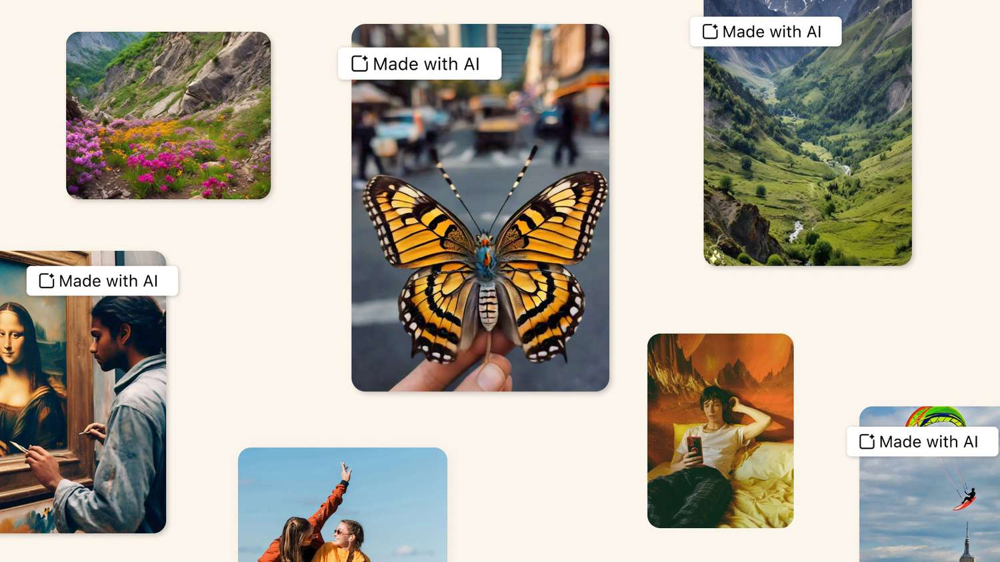

One of the underlying themes of one of my all time favorite TV series *Westworld* can be perfectly summed up this question that keeps popping up throughout the series:

```{=html}
<p><div class="tenor-gif-embed" data-postid="4796147180375266924" data-share-method="host" data-aspect-ratio="1.09756" data-width="100%"><a href="https://tenor.com/view/westworld-of-course-not-nature-of-your-reality-doloresabernathy-gif-4796147180375266924">Westworld Of-course-not GIF</a>from <a href="https://tenor.com/search/westworld-gifs">Westworld GIFs</a></div> <script type="text/javascript" async src="https://tenor.com/embed.js"></script></p>
```

I really hope someone picks up this series right where it left off after Season 4 and allow Lisa Joy and Jonathan Nolan to conclude the story. Why? Because this show perfectly captures what's happening currently in the world we live. From deepfakes to social engineering en masse, everyday we find ourselves questioning the nature of our reality. I can't help but wonder where does this all lead?

But then I asked "Why?"

"Why should

music is one of those rare endeavors in our life

Maybe I am not seeing it

Full disclaimer, I am by no means qualified to answer either of those questions. I am just curious to understand "why does this all matter?"

So fasten your seatbelts because this one is going to get way too confusing!

IT's this weird intermix of simulation theory, AI and everything in meeting,

Let's start off with AI generated 'art', a very highly contested topic these days. This is one of those areas where reality is becoming evasive - multimodal models like Sora, Midjourney, Nano Banana etc. Almost every day we see a new breakthrough in their capabilities and we are almost left awestruck by their realistic outputs. You might have recently seen the news about Google releasing its Nano Banana Pro and how people have started using it to create all sorts of photo-realistic images.

My initial reaction was "It's great that we now have these tools that can generate a selfie of me and Sam Altman set in the 90's. But what is that going to accomplish? And if everyone else can do that too, does it really serve a purpose?"

Going forward, I can see this having use cases in marketing and advertising. One quick prompt and essentially you can have an advertisement of Lionel Messi selling NVIDIA RTX 5090. Unfortunately, what this also means is that these capabilities have a potential of being exploited by bad actors. Long before GenAI was a thing, these platforms were running rampant with scams. According to [Advertising Standards Authority (ASA)](https://uk.finance.yahoo.com/news/celebrity-deepfake-scam-ads-were-000100107.html), adverts featuring celebrities were the most prevalent scams in 2024. Now that the GenAI flood gates have been opened, we are essentially pouring kerosene on fire.

Beyond ads, another area where this is becoming a problem is social media. We all know that social media usage has been [linked to a wide range of adverse mental health outcomes](https://docs.google.com/document/d/1w-HOfseF2wF9YIpXwUUtP65-olnkPyWcgF5BiAtBEy0/edit?tab=t.0#heading=h.r03bz9itohw1) . As a result, social comparison, fear of missing out (FOMO), body objectification, isolation all started skyrocketing. You add GenAI to the mix and the next thing you know everyone is posting their picture perfect lifestyle. So if everyone has this perfect virtual lifestyle, then what are we looking at? What is the purpose of these platforms? Who are we really connecting with: humans or bots?"

Bots have been a thing on the internet for a while. The Dead Internet Theory suggests that the vast majority of activity on the internet is manufactured by bots. People have mixed views on this but one thing everyone can agree on is that there is *some* bot activity. According to [Dan Woods](https://www.teslarati.com/twitter-accounts-80-percent-bots-former-fbi-security-specialist/), a former FBI special agent specializing in cybersecurity, over 80% of Twitter's accounts are actually bots. Other platforms like Instagram, Facebook and Reddit probably have similar figures. So the next time you are arguing with someone on Reddit whether avocado is a fruit or a vegetable, chances are you might be arguing with a bot (if you understood the reference, you should definitely leave a comment!). Take a look at [r/SubSimulatorGPT2](https://www.reddit.com/r/SubSimulatorGPT2/) and you will see what I am talking about.

Will it suffice?

Doesn't mean we shouldn't try

. It was hard as is to figure out how much authenticity

People were already selling their 'perfect' lifestyles on these platforms. Now almost everyone has the capability to create that.

Now with GenAI in the mix,

Social Media platforms allow users to connect with each other. Facebook was designed to be the spot to connect with your high school/college friends. Instagram was the platform for sharing quirly photos with your friends. Reddit was a platfrom where users got to discover niche hobbies.

Don't get me wrong, those platforms still offer those capabilities. Now, it's just a lot harder to tell if it's authentic or if it's just bots.

Troll farms were already a major issue, pre GenAI. In 2020, Facebook found that [19/20 Top Christian Facebook groups](https://www.technologyreview.com/2021/09/16/1035851/facebook-troll-farms-report-us-2020-election/) were troll farms from Eastern Europe and reached nearly 140 million Americans. Now imagine the scale of lies and deception that can be perpetuated through GenAI and bots. All it takes is a few bots and some deepfakes to get people riled up on either side of the political spectrum on hot button topics. Eventually you get to a point where everyone is at each other's throats.

As I ponder over these questions, new questions start emerges: "Are we human?"

"

This is where I came at crossroads and the Human Experience

What does it take to be a human? Or perhaps a better question would be "Are we even human right now?" At this point, you might be going "Woah, slow down Schopenhauer." But hear me out.

In Life 3.0, Max Tegmark proposes that development of life can be divided into three stages:

-   Life 1.0 (biological stage): evolves its hardware and software

-   Life 2.0 (cultural stage): evolves its hardware, designs much of its software

-   Life 3.0 (technological stage): designs its hardware and software


Life 1.0 happened 4 billion years ago in the form of simple microscopic organisms. Life 2.0 (modern humans) arrived thousands years of ago and Life 3.0 is something that may arrive sometime in the future.

> If bacteria are Life 1.0 and humans are Life 2.0, then you might classify mice as 1.1: they can learn many things, but not enough to develop language or invent the internet. Moreover, because they lack language, what they learn gets largely lost when they die, not passed on to the next generation. Similarly, you might argue that today's humans should count as Life 2.1: we can perform minor hardware upgrades such as implanting artificial teeth, knees and pacemakers, but nothing as dramatic as getting ten times taller or acquiring a thousand times bigger brain.

I would even go out on a limb to say that we might be Life 2.5 right now. We practically carry a mini computer with us 24/7. Think about it. If we were to time travel back to 16th Century and go back and show the medieveal men, they would accuse us of witchcraft. Imagine trying to explain we can easily navigate places thanks to a GPS to the early explorers. Or the fact that we now have language translation capabilities that allow us to communicate in multiple languages.

In fact we might be getting started at Life 2.6 with all these neuralink brain implants. [Noland Arbaugh](https://readwrite.com/first-neuralink-patient-says-implant-is-like-an-aimbot-for-gaming-explains-how-gaming-industry-may-have-to-change/), one of the first patients to receive a brain-computer chip implanted by Neuralink, admits that have that implant is like having an aimbot in his head and he can easily control the mouse with his thoughts. Assuming Neuralink takes off, it looks like telepathy is back on the table.

So at what point do we no longer remain these biological organisms and instead become these *entities?*

Here's a simple thought experiment: Let's say Person A want to send an email to Person B. Person A could take some time to draft a well written email and send it to Person B, just like we all used to do until 2022. Or Person A could ask ChatGPT to do that for him. He decides to go with the latter option. Person B receives the email and how he has two options: he can either read the entire email or simply ask ChatGPT to summarize it. Lo and Behold, Person B goes with the latter.

Would we call this a human interaction or an AI interaction?

The other day I was scrolling r/metalcore and came across [this article](https://nerdist.com/article/spotify-has-removed-75-million-songs-to-combat-ai-slop/) outlining how Spotify removed 75 million songs to combat AI Slop. My initial reaction was like "It's good that we are differentiating between human generated content and AI generated content."

But how do you define "human generated" and "AI generated"? The earliest records of music in human society can be traced back to the [Paleolithic](https://books.google.co.in/books?id=vYQEakqM4I0C&redir_esc=y "Paleolithic") period and it is certainly possible singing existed before then. We have found remains of flutes, drums and other percussion instruments. Over time as we evolved, so did our mediums for producing music. While our definitions for music have constantly changed, at the end of its a specific arrangement of different sounds to create a melody, harmony and rhythm. Now we have eight string electric guitars and Digital Audio Workstations where we can practically create any sound known to mankind. Almost every artist is now working with audio engineers and sound technicians to create the best possible music they can. Personally, I use various digital plugs in FL Studio to add new synth effects and sounds because I don't have a keyboard.

So the question becomes - do we still consider this as music even though I am using *technology* to create something? What about EDM? It literally stands for Electronic Dance Music? Some people don't consider that to be music because it's *electronic* and that's fine. But isn't it made up of specific arrangement of different sounds? Then we have Auto-Tune. and audio enhancements.

In *Perfecting Sound Forever: An Aural History of Recorded Music,* music engineer Tom Lord-Alge mentions that Auto-Tune is used on nearly every record these days. Is it justified? Personally speaking, I am not the biggest fan of overly processed music to the point it essentially alters the essence of the original music. But now I kinda see why it's being used. Yes, it's morally wrong to sell your records to your fans and claim that it was '100% original'. But is it wrong to *enhance* your work a little bit so that it's crisper? What about AI then? Why is it any different if a sound engineer uses AI to produce music? What if someone actually likes an Auto-Tuned/AI generated song?

Yeah it feels 'wrong' that AI can whip up a pop song in under 5 minutes, something that would take a real artist 5 months. But isn't that the case with everything else - chess, go, arithmetic and other areas where AI continues to surpass us? This is something I talked about in one of my previous [posts](https://aryamik.github.io/posts/2025-04-12/) and why I think this is less of a *technological* problem and more of a *ego* problem of our society wherein we cannot quite grasp the fact that there will come a time when we are no longer the apex species in these different domains.

Now we can get into the technicality and semantics all day long. For instance, one might argue that it's two humans involved in a conversation that is facilitated by AI. But what if this conversation was happening in real time via AI? For Person A, the AI is automatically generating an email without his inputs and for Person B, the AI is automatically summarizing the email. Is that still a human interaction?

Given what we know about the three stages of life as outlined by Max Tegmark, would we still think of this as a human interaction if the individuals were communicating telepathically via Neuralink implants?

I mean would we even call those individuals as human beings? If not, would it be fair to call them bots/androids/robots/hosts/\*insert your favorite terminology used to describe AI?

This brings us back to the Dead Internet Theory where it's bots interacting with other bots. Truth is we are seeing this played out in reality. Consider this headline I saw a while back:


Sounds familiar?

It makes you wonder what is happening? In a way this is bots vs bots, or AI vs AI bringing us back to the Dead Internet Theory.

|     | U+00AE |
|-----|--------|

More scams, more adverse mental health outcomes,

Worse yet, it opens the door for

Filters on apps like Snapchat and TikTok opened the doors for individuals to alter their personas to a point where their true selves no longer pass muster.

multimodal tools like Flux Kontext Pro and Google's Nano Banana take these image altering capabilities to the next level and I am worried about these tools being used by individuals to sell their perfect lives. And before you know it, everyone is looking at AI content on these platforms.

"Oh, that's a nice Facebook group that you are part of. I just hope it's not a [massive troll farm](https://www.technologyreview.com/2021/09/16/1035851/facebook-troll-farms-report-us-2020-election/) that is spewing propaganda and is influencing elections."

"That person has such an amazing Instagram profile. I just wish I had her lifestyle and her looks. I mean there is no way she is using AI to sell us this perfect lifestyle, right?"

"That's a nice subreddit. It would be a shame if it got infiltrated by bots."

"Wow. Look at this guy. He has the perfect looks, has met with all these celebrities. I should consider messaging him. There is no way he is catfishing by posting all these ultra realistic photos. It has to be real, right?"

My point being where does this all end?

I don't think it's normal for us to constantly question

Does this end with people getting constantly riled up on either side of the political spectrum on hot button topics thanks to the deepfakes of politicians and world leaders. The scary part is they almost feel too real and unfortunately, some individuals will buy that as hook, line and sinker.

Then what do we value?

Does this end with people

If everything is AI generated, then where does that leave us? More importantly, who are we?

"Are we still humans?"

It's still happening. But bots are present.

Hard to tell if it's authentic or if it's just bots.

Who are we connecting with?

So what does this have to do with reality and our society?

Even before GenAI took off, bots were being used by bad actors.

Social media use has been [linked to a wide range of adverse mental health outcomes](https://docs.google.com/document/d/1w-HOfseF2wF9YIpXwUUtP65-olnkPyWcgF5BiAtBEy0/edit?tab=t.0#heading=h.r03bz9itohw1) - social comparison, fear of missing out (FOMO), body objectification, isolation, interpersonal relationships, communication skills to name a few. Filters on apps like Snapchat and TikTok opened the doors for individuals to alter their personas to a point where their true selves no longer pass muster. In order to provide a good first impression, social media users feel pressured to exhibit the most appealing versions of themselves to others. As I mentioned earlier, multimodal tools like Flux Kontext Pro and Google's Nano Banana take these image altering capabilities to the next level and I am worried about these tools being used by individuals to sell their perfect lives. And before you know it, everyone is looking at AI content on these platforms.

Beyond scams, it raises a bigger question: "If we get to a point where AI Generated ads become the norm and we all know that these ads are AI Generated; how are we going to trust what we see?"

Maybe we will need to rethink the idea of marketing.

Someone left a comment that said "From now on, we are going to assume it's AI unless someone explicitly tells me so" and I echo with that sentiment.

Just like with

There are all these talks of how these models could be used to create ads with a click of a button. Sure, eventually those ads will become the norm but If we know it's all going to be AI generated, then ? Unfortunately,

It's worth noting that implications for this are tied to our wellbeing and the functioning of our society. Social media use has been [linked to a wide range of adverse mental health outcomes](https://docs.google.com/document/d/1w-HOfseF2wF9YIpXwUUtP65-olnkPyWcgF5BiAtBEy0/edit?tab=t.0#heading=h.r03bz9itohw1) - social comparison, fear of missing out (FOMO), body objectification, isolation, interpersonal relationships, communication skills to name a few. Filters on apps like Snapchat and TikTok opened the doors for individuals to alter their personas to a point where their true selves no longer pass muster. In order to provide a good first impression, social media users feel pressured to exhibit the most appealing versions of themselves to others. As I mentioned earlier, multimodal tools like Flux Kontext Pro and Google's Nano Banana take these image altering capabilities to the next level and I am worried about these tools being used by individuals to sell their perfect lives. And before you know it, everyone is looking at AI content on these platforms.

Maybe we human beings will always have an appetite for pure/bare-bones music, something like Oliver Anothony's [Rich Man North of Richmond](https://www.youtube.com/watch?v=sqSA-SY5Hro&list=RDsqSA-SY5Hro&start_radio=1&pp=ygUOb2xpdmVyIGFudGhvbnmgBwE%3D) and there will be a market for AI generated music? After all, different strokes for different folks, amirite?

AI generated art raises a whole bunch ofRaises moral and ethical questions? Is it acceptable to like AI generated art? The most prevailing argument I keep hearing on this topic is that it could be labelled as 'art' but it's different from the art humans produce?

You might be like "Duh". But how do you define different?

And

Beyond our digital wellbeing, I think there are broader societal implications. This is where it gets really convulated with the Dead Internet Theory and bots. According to the Dead Internet Theory, a vast majority of activity on the internet is manufactured by bots. People have mixed views on this but one thing everyone can agree on is that there is *some* bot activity on the internet. According to [Dan Woods](https://www.teslarati.com/twitter-accounts-80-percent-bots-former-fbi-security-specialist/), a former FBI special agent specializing in cybersecurity, over 80% of Twitter's accounts are actually bots. A couple of years ago, I found about [r/SubSimulatorGPT2](https://www.reddit.com/r/SubSimulatorGPT2/) and was equal parts amazed and worried knowing that this is a subreddit populated entirely by AI chatbots.

So what does this have to do with reality and our society?

Even before GenAI took off, bots were being used by bad actors. In 2020, Facebook found that [19/20 Top Christian Facebook groups](https://www.technologyreview.com/2021/09/16/1035851/facebook-troll-farms-report-us-2020-election/) were troll farms from Eastern Europe and reached nearly 140 million Americans. Now imagine the scale of lies and deception that can be perpetuated through GenAI and bots. All it takes is a few bots to get people riled up on either side of the political spectrum on hot button topics. I mean look at all the deepfakes of politicians and world leaders. The scary part is they almost feel too real and unfortunately, some individuals will buy that as hook, line and sinker. Eventually you get to a point where everyone is at each other's throats. No one is *willing* to believe in anything and that is how people start losing their trust in the democratic outcomes. The scary part is, in the last 10 years, the trust in Global Democracy Index is already at an all time low.


If everything we look around is generated by AI - photos, videos,

What are we at that point?

We are bots interacting with bots. Now this is where it gets dicey.

What does it take to be a human? Or perhaps a better question would be "Are we even human right now?" At this point, you might be going "Woah, slow down Schopenhauer." But hear me out.

In Life 3.0, Max Tegmark proposes that development of life can be divided into three stages:

-   Life 1.0 (biological stage): evolves its hardware and software

-   Life 2.0 (cultural stage): evolves its hardware, designs much of its software

-   Life 3.0 (technological stage): designs its hardware and software


Life 1.0 happened 4 billion years ago in the form of simple microscopic organisms. Life 2.0 (modern humans) arrived thousands years of ago and Life 3.0 is something that may arrive sometime in the future.

> If bacteria are Life 1.0 and humans are Life 2.0, then you might classify mice as 1.1: they can learn many things, but not enough to develop language or invent the internet. Moreover, because they lack language, what they learn gets largely lost when they die, not passed on to the next generation. Similarly, you might argue that today's humans should count as Life 2.1: we can perform minor hardware upgrades such as implanting artificial teeth, knees and pacemakers, but nothing as dramatic as getting ten times taller or acquiring a thousand times bigger brain.

I would even go out on a limb to say that we might be Life 2.5 right now. We practically carry a mini computer with us 24/7. Think about it. If we were to time travel back to 16th Century and go back and show the medieveal men, they would accuse us of witchcraft. Imagine trying to explain we can easily navigate places thanks to a GPS to the early explorers. Or the fact that we now have language translation capabilities that allow us to communicate in multiple languages.

In fact we might be getting started at Life 2.6 with all these neuralink brain implants. [Noland Arbaugh](https://readwrite.com/first-neuralink-patient-says-implant-is-like-an-aimbot-for-gaming-explains-how-gaming-industry-may-have-to-change/), one of the first patients to receive a brain-computer chip implanted by Neuralink, admits that have that implant is like having an aimbot in his head and he can easily control the mouse with his thoughts. Assuming Neuralink takes off, it looks like telepathy is back on the table.

So at what point do we no longer remain these biological organisms and instead become these *entities?*

Here's a simple thought experiment: Let's say Person A want to send an email to Person B. Person A could take some time to draft a well written email and send it to Person B, just like we all used to do until 2022. Or Person A could ask ChatGPT to do that for him. He decides to go with the latter option. Person B receives the email and how he has two options: he can either read the entire email or simply ask ChatGPT to summarize it. Lo and Behold, Person B goes with the latter.

Would we call this a human interaction or an AI interaction?

Now we can get into the technicality and semantics all day long. For instance, one might argue that it's two humans involved in a conversation that is facilitated by AI. But what if this conversation was happening in real time via AI? For Person A, the AI is automatically generating an email without his inputs and for Person B, the AI is automatically summarizing the email. Is that still a human interaction?

Given what we know about the three stages of life as outlined by Max Tegmark, would we still think of this as a human interaction if the individuals were communicating telepathically via Neuralink implants?

I mean would we even call those individuals as human beings? If not, would it be fair to call them bots/androids/robots/hosts/\*insert your favorite terminology used to describe AI?

This brings us back to the Dead Internet Theory where it's bots interacting with other bots. Truth is we are seeing this played out in reality. Consider this headline I saw a while back:


Sounds familiar?

It makes you wonder what is happening? In a way this is bots vs bots, or AI vs AI bringing us back to the Dead Internet Theory.

So where does that leave us in terms of where we are headed and our nature of our reality? Ironically, *Westworld* does answer that question perfectly throughout the series:

```{=html}
<p><div class="tenor-gif-embed" data-postid="20585026" data-share-method="host" data-aspect-ratio="1" data-width="100%"><a href="https://tenor.com/view/westworld-if-you-cant-tell-does-it-matter-gif-20585026">Westworld If You Cant Tell GIF</a>from <a href="https://tenor.com/search/westworld-gifs">Westworld GIFs</a></div> <script type="text/javascript" async src="https://tenor.com/embed.js"></script></p>
```

If we ever get to the point where the lines between reality and perception become interchangeable (Hello, Simulation Theory?), will it really matter? Maybe. Maybe not.

I mean I don't think we can even prove that what we are living in is a simulation.

Instead, a better question we should be asking ourselves is "Why?"

Why does it matter that we have seperate art from human

"Why does it matter we flag AI generated music on our platform?"

"Why do we add a label for AI generated pictures?"

Now simply answering the why won't magically fix anything. But I'm hopeful it would provide us a starting point among all this chaos we live in. Or at the very least, it would help us get to the question "Why do we value being a human being?"

I am reminded me of the core tenants of the philosophical school that inspired this medium that you are currently on. As Epictetus said,

> The chief task in life is simply this: to identify and separate matters so that I can say clearly to myself which are externals not under my control, and which have to do with the choices I actually control. Where then do I look for good and evil? Not to uncontrollable externals, but within myself to the choices that are my own.

While we may not have influence as invidiuals over the fact that we are in this collective arms race to develop AGI, similar to the Manhattan Project; we still have the power to get our act together and create a more harmonious human society characterized by cooperation toward shared goals and values.

Alright, that's all folks. That's enough internet for today and maybe I need to start watching more sitcoms.


technological evolution outpacing us biologicallly.

Thanks to bots,

Bots have been on the internet for a while now. At first, I used to be dismissive about the mere idea of bots on the internet. I mean how would you even run them?

But there is

D

when it comes to . Flood gates have been opened to the point

there's another aspect of bots.

Withi

The good news is there is work being done to mitigate these issues. For instance, [Meta has started putting labels](https://about.fb.com/news/2024/02/labeling-ai-generated-images-on-facebook-instagram-and-threads/) on AI generated content across Facebook, Instagram and Threads.



But then it makes me wonder, is that going to be enough? Do we then rely on the AI detection systems to shield us from fake content? It reminds me of how professors are now using AI detection systems/plagiarism checkers that can tell whether assignments are generated by AI. Problem with these anti AI systems is that they are a hit or a miss. Sure they can help in detecting the obvious AI content. But if someone is smart enough to tweak these through careful prompting then these AI detection systems can be rendered moot. Similar to my music production example, at what point does it constitute as an AI?What if a student uses ChatGPT to come up with a rough framework for his assignment but uses different sources to essentially mask the AI content to the point it passes the anti AI system? What if a student uses ChatGPT as an idea board to brainstorm new ideas for his assignment?

Ultimately, are we locked in this never ending battle of cat and mouse where we create AI content and then we detect its an AI and keep going back and forth?

The purpose of this post was to not to paint a bleak picture and suggest that we are headed for a dystopian future.

I don't know if the Dead Internet Theory is actually true but at this point if we were to objectively look at the facts, we can reasonably conclude:

-   There is *some* bot activity happening on the internet.

And the implications were beyond scams.

So it makes me ponder if this trend keeps on going, are we headed for

What even is reality at that point?

Democracy . Unironically, we can tell this is AI. and brush it off with the good 'ol "Oh it's probably AI". As a rule of thumb, if it seems too good to be true, it's most likely AI generated. Why? Because there is an 'uncanny' valley when it comes to AI generated content we see today. Let's look at an example. I went to Perchance and asked it to generate an image of a labradoodle in the style of Disney's Pixar movies. Here is what it came up with:


Not bad, right? It almost gives off the vibe that this labradoodle is from Pixar's Universe. But that's when it hits you. Maybe the lighting feels off, maybe the proportions feel too artificial or maybe it feels too perfect. In other words there is a 'not real' filter ingrained within us that allow us to rule out AI generated content instinctively. But notice how I used the phrase "AI generated content we see **today".** Sure we may take a victory lap for being able to detect AI content with our naked eyes right now. For all we know, a new frontier model maybe released tomorrow that essentially bypasses our natural instincts. What do we do then?

.

Google's Nano Banana Pro is making headways. I wonder what's next. Soon enough we will have po

Maybe it won't matter because eventually it will just be *music.* Maybe these definitions and delineations between 'artificial' and 'human' are something that we created for ourselves. Maybe this is truly what we become.

Is it scary? I'll admit it is. But isn't change a scary thing?

A lot of this might be the semantics. But remember words have powers.

https://www.goodreads.com/book/show/6374049-perfecting-sound-forever

**Music** is the arrangement of [sound](https://en.wikipedia.org/wiki/Sound "Sound") to create some combination of [form](https://en.wikipedia.org/wiki/Musical_form "Musical form"), [harmony](https://en.wikipedia.org/wiki/Harmony "Harmony"), [melody](https://en.wikipedia.org/wiki/Melody "Melody"), [rhythm](https://en.wikipedia.org/wiki/Rhythm "Rhythm"), or otherwise [expressive content](https://en.wikipedia.org/wiki/Musical_expression "Musical expression").

It should not be a controversial take to ask for regulations that prevent bad actors from misleading the general public through AI. As a rule of thumb, anything that is generated by AI needs to be disclosed - whether it is music, art, media or anything else. The good news is we are already seeing this being implemented across various platforms

At what point does it become AI? I have talked about the AI effect before and how essentially slapping the word AI on everything makes it absolutely meaningless. But coming back to

Also at what point does it stop becoming a content generated

Sounds simple enough, right?

But what is that saying again?

"The truth is rarely pure and hardly simple".

ndefinedHere's the this is going to become the norm.

So what do we do? Can we combat this?

Dead Internet Theory

In other words, one of the best ways for you to improve the future of life is to improve tomorrow.

A strategy that's likely to help with essentially all AI challenges is for us to get our act together and improve our human society before AI fully takes off. We're better off educating our young to make technology robust and beneficial before ceding great power to it. We're better off modernizing our laws before technology makes them obsolete. We're better off resolving international conflicts before they escalate into an arms race in autonomous weapons. We're better off creating an economy that ensures prosperity for all before AI potentially amplifies inequalities. We're better off in a society where AI-safety research results get implemented rather than ignored. And looking further ahead, to challenges related to superhuman AGI, we're better off agreeing on at least some basic ethical standards before we start teaching these standards to powerful machines. In a polarized and chaotic world, people with the power to use AI for malicious purposes will have more motivation and ability to do so, and teams racing to build AGI will feel more pressure to cut corners on safety than to cooperate. You have power to do so in many ways. Of course you can vote at the ballot box and tell your politicians what you think about education, privacy, lethal autonomous weapons, technological unemployment and other issues. But you also vote every day through what you choose to buy, what news you choose to consume, what you choose to share and what sort of role model you choose to be. Do you want to be someone who interrupts all their conversations by checking their smartphone, or someone who feels empowered by using technology in a planned and deliberate way? Do you want to own your technology or do you want your technology to own you? What do you want it to mean to be human in the age of AI? Please discuss all this with those around you---it's not only an important conversation, but a fascinating one.

We're the guardians of the future of life now as we shape the age of AI. Although I cried in London, I

Now let this arms race
