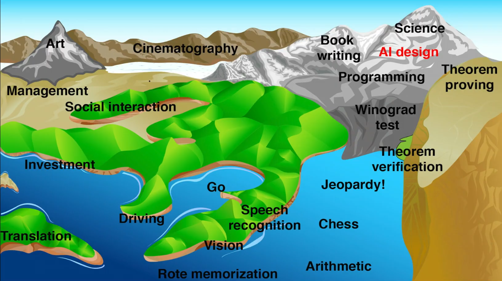
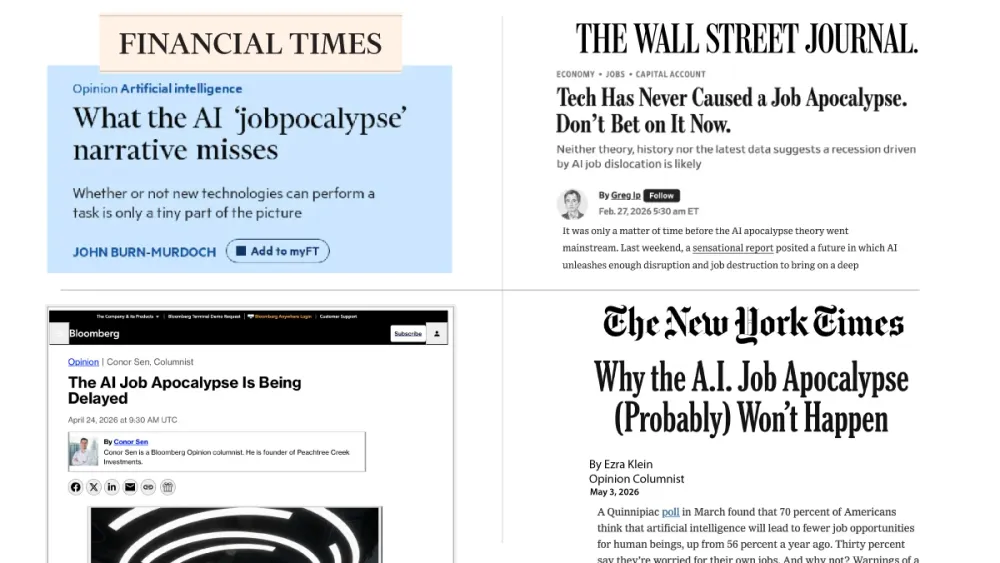
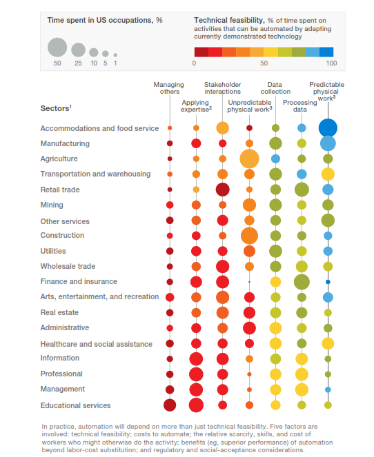

Growing up, we all heard the phrase "Jack of all, master of none" which essentially implies that someone who dabbles in multiple things is not necessarily good at one specific thing. Sure, there is nothing wrong in trying out different stuff but don't expect to become exceptional at any one of those. Atleast that's what the conventional wisdom told us. Thousands of self-help books, articles, podcasts and videos have alluded to the fact that we really got to find our niche and get good at it. After all, that is the secret sauce behind Tiger Woods, Steve Jobs, Beethoven, Michael Jordan, \*insert any exceptional individual. This is the classical school of deliberate practice that has been popularized by individuals like K. Anders Ericsson.

I used to be all in on this notion. That was until I read *Range* by David Epstein. I saw this book recommended by Anthony Capuano, President and CEO of Marriott International in Bloomberg's [*The 82 Books That Top Business Leaders Couldn’t Put Down* 2025](https://www.bloomberg.com/features/2025-best-books/) edition (Some great recommendations. do check them out!). The central message of the book is:

> In a world that is seemingly complex, we need a wide array of skills in multiple domains to truly make a mark. In other words, breadth is equally important to depth.

I gotta say, this premise got me hooked. It shouldn't come off as a surprise given that the name of the medium that you are currently on is titled [Sympatheia](https://aryamik.github.io/posts/2024-07-01/) which is about interconnectedness of the world we live in. But as I started reading more, I felt like the contents of this book are very timely, especially as the age of AI dawns upon us. There are concerns about our future, economy, automation and jobs. Naturally the question that seems to be on everyone's mind is "What are the skills I need for the future?" I felt like this book provides us with a blueprint of how we should be thinking about the requisite skills needed not just to survive, but thrive in this age. In this two part series, first I will explore some of the skills mentioned in the book that can help us prepare for the future and then in a later edition explore some of the practical frameworks as well as some of the limitations of narrow specializations.

David breaks down the to path to mastery in two different models - the 'Tiger' model and the 'Roger' model named after Tiger Woods and Roger Federer respectively. Tiger Woods is the epitome of what excellence looks like. Son of a pro-golfer who got introduced to the sport at the age of two. He worked extensively on his golf skills for decades, won countless accolades and is revered as one of the greatest athletes of all time. For Tiger Woods, it was golf or nothing. Contrast that with Roger Federer. As a young kid, he dabbled in squash, skiing, wrestling, swimming, basketball, skateboarding, soccer, handball before he eventually settled on tennis which didn't happen until he turned twelve.

In the book, Tiger exemplifies the 'specialist' model and Roger exemplifies the 'generalist' model. There are other models and frameworks used by different individuals that are referenced in the book and this is where we start to see these two schools of thought starting to emerge:

| Individual     | Specialist    | Generalist      |
|----------------|---------------|-----------------|
| David Epstein  | Tiger         | Roger           |
| Freeman Dyson  | Focused Frogs | Visionary Birds |
| Philip Tetlock | Hedgehog      | Fox             |
| Jayshree Seth  | I shaped      | T shaped        |

At this point, you might be wondering "Should I be a generalist or a specialist?"

Spoiler alert. The answer is

"Yes"

```{=html}
<p><iframe src="https://giphy.com/embed/NcrhM3USM6TABpus85" width="480" height="269" style="" frameBorder="0" class="giphy-embed" allowFullScreen></iframe><p><a href="https://giphy.com/gifs/oh-ooohh-of-course-NcrhM3USM6TABpus85">via GIPHY</a></p></p>
```

There you go. A very bureaucratic answer. Thanks for coming to my TED Talk.

The not-so-climatic-answer is "it depends entirely on the domain in question." Or as Daniel Kahneman and Gary Klein eloquently put it in their famous 2009 paper '[Conditions for intuitive expertise](https://www.researchgate.net/publication/26798603_Conditions_for_Intuitive_Expertise)' :

> evaluating the likely quality of an intuitive judgment requires an assessment of the predictability of the environment in which the judgment is made and of the individual’s opportunity to learn the regularities of that environment.

Klein found out that in "kind" learning environments (a term coined by psychologist [Robin Hogarth](https://www.jstor.org/stable/44318900)) where patterns repeat over and over, and feedback is extremely accurate; instinctive pattern recognition worked remarkably well. Think chess, firefighters, golf. This is where the deliberate practice model outlined by K. Anders Ericsson comes in. On the other hand, Kahneman found that in "wicked" learning environments (another coined by psychologist Robin Hogarth) where the rules of the game are unclear or incomplete, repetitive patterns may not exist and feedback is ambigious; experience will reinforce the exact wrong lessons. Think of financial or political trends, or of how employees or patients would perform.

It should be noted that world is not perfectly categorized into 'kind' and 'wicked' environments and like most things in life, it's a spectrum. Sure the world is complex but if you think about it, most "wicked" environments are nothing but a series of "kind" environments. It all comes down to intuition, experience and wisdom.

All this talk of "kind" and "wicked" environments made me think about AI, jobs, skills and everything in between. If there's one thing that we learned from the history of technological innovation, it's that we like to reduce the procedural grunt work. And if that trend continues, we can extrapolate that to the future of our society. That is a very timely topic, especially now in this age of AI. We are seeing breakthroughs in AI capabilities every single day and it has already superseded us in so many domains - Go, Chess, Vision, Arithmetic to name a few. I am going to borrow [Max Tegmark's](https://youtu.be/2LRwvU6gEbA) famous AI Landscape of Tasks (again) where the elevation represents how hard it is for AI to do each task at human level, and the sea level represents what AI can do today. The sea level is rising as AI improves, so there's a kind of global warming going on here in the task landscape.

[](https://youtu.be/2LRwvU6gEbA)

One thing to note about this infographic is that it is from 2017. Given the current landscape, one might even argue that the sea level is almost up at the peaks. However, despite these breakthroughs, it is still lagging behind at seemingly mundane tasks. Feats of intelligence that are synonymous with playing chess, Go are fairly easy for computers to carry out and relatively mundane tasks like moving around, objection recognition are very hard for machines to do. This is the classic **Moravec's paradox** that [Hans Moravec](https://en.wikipedia.org/wiki/Hans_Moravec "Hans Moravec") wrote in 1988

> It is comparatively easy to make computers exhibit adult level performance on intelligence tests or playing checkers, and difficult or impossible to give them the skills of a one-year-old when it comes to perception and mobility

As a result, we find ourselves in quite a strange predicament. On one hand, we are observing AI breeze past some of the skills that took us decades to hone. This makes us wonder "Is it going to come for me?"

[Eloundou et al. (2023)](https://arxiv.org/abs/2303.10130) estimate that around 80% of the U.S. workforce could have atleast 10% of their work tasks affected by the introduction of LLMs. Only 36 job categories out of 1,016 had no overlap with AI. On the other hand, last week I was reading [Andrew Ng's weekly newsletter](https://www.deeplearning.ai/the-batch/issue-352) (highly recommend subscribing to this one!) and he mentioned there will be no 'AI jobpicalypse'.

[](https://www.deeplearning.ai/the-batch/issue-352)

But at the same time, if AI does not even have the neurological skills of a one year old, how do we prepare for the inevitable, if it does end up happening?

We do know that AI is going to have an impact on the work that we do. Whether it's positive or negative, that remains to be seen. Clearly, there is a lot of ambiguity on this topic and rightfully so because even the experts don't exactly know how it's all going to play out. That being said, we can find solace (for now!) in some of these observations that we can draw:

1\) In the current state, AI excels at doing procedural, repetitive tasks; surpassing our capabilities. In other words, it excels in 'kind environments'.

The more constrained and repetitive a task or a challenge, the more likely it will be automated. NVIDIA's CEO, [Jensen Huang](https://youtu.be/3hptKYix4X8) said "If the task is your job, then it will get automated". Going back to Max Tegmark's AI Landscape of Tasks, he jokingly remarks in his TED talk "The obvious takeaway is to avoid careers at the waterfront."

Empirical evidence seems to suggest this as well. You can easily look up "jobs that are going to be the most susceptible to automation" online but I really liked [this article from McKinsey](https://www.mckinsey.com/capabilities/tech-and-ai/our-insights/where-machines-could-replace-humans-and-where-they-cant-yet#/) that Max referenced in Life 3.0. It's almost a decade old, but the key takeaway is that "it's more more technically feasible to automate predictable physical activities than unpredictable ones."

[](https://www.mckinsey.com/capabilities/tech-and-ai/our-insights/where-machines-could-replace-humans-and-where-they-cant-yet#/)

"Predictable physical activities". Does that ring a bell? That's basically 'kind' environments.

2\) Now that we have established AI excels in "kind" environments and predictable physical work is more likely to be automated, we can now look at the opposite end of the spectrum and derive that our competitive advantage would lie in focusing our efforts on the big picture stuff. This means taking conceptual knowledge from one problem or domain and applying it in an entirely new one. As David mentions in the book:

> The bigger the picture, the more unique the potential human contribution. Our greatest strength is the exact opposite of narrow specialization. It is the ability to integrate broadly.

And whether we like it or not, we may not have much to contribute in narrow enough worlds. That's according to [Gary Marcus](https://www.youtube.com/watch?v=3E34bf2G5mE), professor emeritus of psychology and neural science at New York University and founder of Geometric Intelligence, a machine learning company acquired by Uber. He is not alone in sharing these thoughts. [Andy Ouderkirk](https://www.linkedin.com/in/andrew-ouderkirk-9526323b), former Research Director at Meta and Corporate Scientist at 3M and has over 550 patents to his resume. He was one of the many individuals mentioned in the book that made me go "woah!". Anyways, Ouderkirk remarks that

> As information becomes more broadly available, the need for somebody to just advance a field isn’t as critical because in effect they are available to everybody.

At this point you might be wondering, "Yeah that all sounds well and good. But what are the skills we need to cultivate in this age of AI?" Ask, and Ye Shall Receive. In the book, David references the work of Abbie Griffin, a professor at University of Utah who "has made it her work to study modern Thomas Edisons - serial innovators". In the book *Serial Innovators: How Individuals Create and Deliver Breakthrough Innovations in Mature Firms,* Abbie along with Raymond Price and Bruce Vojak investigate how pioneers at large, mature organizations repeatedly create and deliver breakthrough innovations. Their findings showed that these individuals had the following characteristics (you might want to take out your notebooks for this one):

- high tolerance for ambiguity;

- systems thinkers;

- additional technical knowledge from peripheral domains;

- repurposing what is already available;

- adept at using analogous domains for finding inputs to the invention process;

- ability to connect disparate pieces of information in new ways;

- synthesizing information from many different sources;

- appear to flit among ideas;

- broad range of interests;

- they read more (and more broadly) than other technologists and have a wider range of outside interests;

- need to learn significantly across multiple domains;

- communicate with various individuals with technical expertise outside of their own domain.

This might not be an exhaustive list but it's enough to get us started about figuring out what skills we need to thrive in this complex world. While we are on the topic of future of work and our society, an equally important question that we all seem to think about is "What advice should we give to younger generation who is entering the workforce?"

For all we know, some of the traditional career paths might be out of the window in the not so distant future. Turns out Paul Graham, computer scientist and cofounder of Y Combinator— has some good advice in a [high school graduation speech he wrote in 2005](https://www.paulgraham.com/hs.html), but never delivered. I would urge you to read the whole thing but I'll share the parts that I really liked:

> It might seem that nothing would be easier than deciding what you like, but it turns out to be hard, partly because it’s hard to get an accurate picture of most jobs. . . . Most of the work I’ve done in the last ten years didn’t exist when I was in high school. . . . In such a world it’s not a good idea to have fixed plans.
>
> And yet every May, speakers all over the country fire up the Standard Graduation Speech, the theme of which is: don’t give up on your dreams. I know what they mean, but this is a bad way to put it, because it implies you’re supposed to be bound by some plan you made early on. The computer world has a name for this: premature optimization. . . .
>
> . . . Instead of working back from a goal, work forward from promising situations. This is what most successful people actually do anyway.
>
> In the graduation-speech approach, you decide where you want to be in twenty years, and then ask: what should I do now to get there? I propose instead that you don’t commit to anything in the future, but just look at the options available now, and choose those that will give you the most promising range of options afterward.

These elements from Paul's speech embody what Herminia Ibarra, a professor of organizational behavior at London Business School (another interesting individual that you should definitely look up!), calls the “test-and-learn” model as opposed to the “plan-and-implement” model where we make a long-term plan and execute without deviation. As she succintly puts it, “We discover the possibilities by doing, by trying new activities, building new networks, finding new role models.”

Now you might be thinking at this point. "Easier said than done." And I would agree. Sometimes we don't have the luxury of experimenting new stuff and we have to pick a lane. This is something Todd Rose, director of Harvard’s Mind, Brain, and Education program, and computational neuroscientist Ogi Ogas have studied extensively and they describe "Standarization Covenant" as the cultural notion that it is rational to trade a path of exploration for a path that ensures stability. Ibarra, Rose and Ogas are not saying that we shouldn't have career goals like pursuing a PhD or becoming a doctor. On the contrary, they should act as our guiding principles. But the key takeaway for us is that in a world that is rapidly changing before our eyes, it can be riskier to make a commitment before you know how it fits you.

One might say that we have always done that. People were switching careers to find a better fit since forever and I don't anticipate this changing in the future. But the rate at which the change is happening is unprecedented. Before, we used to have *relatively* longer periods of economic stability. If you were an accountant in the 20th century, you could practically go through your career without any major disruptions in your field. In other words, the environments were "kind"-er. Besides career paths were limited. Growing up, the two predominant career paths for kids my age were either becoming a doctor or an engineer. So the conventional wisdom of "start early, pick a lane and never waver" made sense in that context.

Now, hardly a day goes when we don't hear about a technological disruption that is dramatically changing the way we work. This means certain skills are getting phased out sooner than we can anticipate. This begs the question "Do we still tell the younger generation to learn \**insert skill X* when in reality it may not even be a thing six months down the road?" I still believe that most jobs will have the 'human-in-the-loop' model which means that most of the heavy lifting for routine tasks will be done by computers but we would still need humans to provide crucial oversight, offering your unique perspective, critical thinking skills, and ethical considerations. This is one the four pillars Ethan Mollick describes in *Co-Intelligence* (another great read; worth checking out). In short, we need to develop a tolerance for ambiguity (one of the skills mentioned by Abbie Griffin) as well being adaptable for these 'wicked' environments.

There you have it. A somewhat functional blueprint that you can start adopting to 'AI-Proof' yourself. In the next edition, I will explore some of the frameworks that I really liked when it comes to developing *Range* as well as some the downsides of being too specialized at something.
