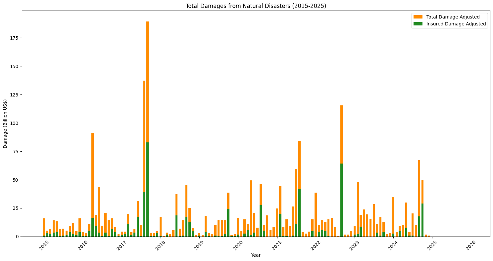
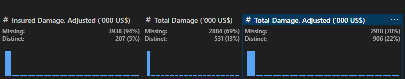
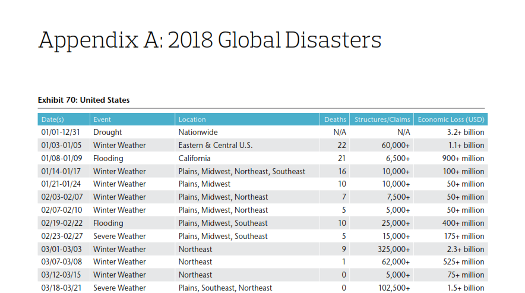
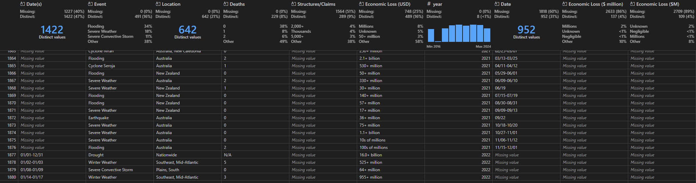
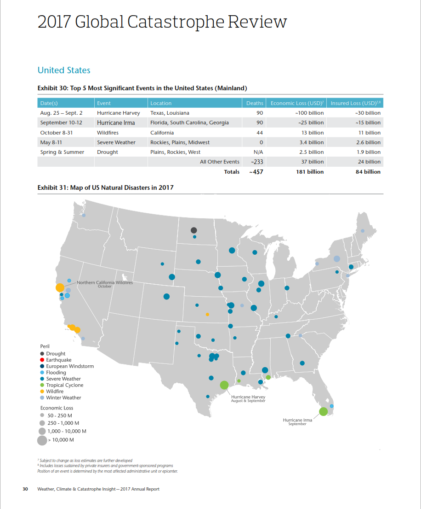
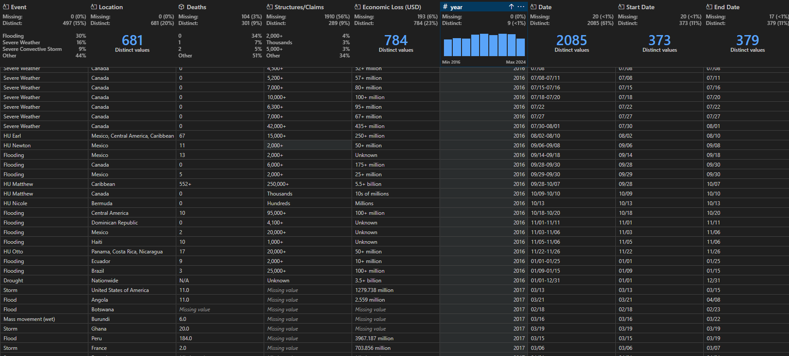

It's almost 2026 and I thought it's only fair to wrap up 2025 with a topic that has fascinated me throughout the year:


I found out about it through Bloomberg Green's daily newsletters and for some reason the idea of quantifying the magnitude of extreme weather events and natural disasters and then translating that into a dollar amount has always intrigued me.

Naturally, it got me thinking about doing *something* with cat modeling. Obvious place to start was gathering data. Turns out that in itself turned out to be an endeavor and you'll see why shortly.

I started looking for something that was open source. I literally typed in "Open Source Global Catastrophe Data" in my search bar and the first result was [Emergency Events Database (EM-DAT)](https://www.emdat.be/). According to their website, "EM-DAT was created in 1988 as a joint initiative between the Centre for Research on the Epidemiology of Disasters (CRED) and the World Health Organization (WHO) and contains data on the occurrence and impacts of over 27,000 mass disasters worldwide from 1900 to the present day. The database is compiled from various sources, including UN agencies, non-governmental organizations, reinsurance companies, research institutes, and press agencies."

Jackpot. Or atleast, that's what I thought. The database classifies disasters into two groups of hazards: **natural** and **technological**. It records data at the country level for human and economic losses for these disasters. Since I was pretty much interested in natural disasters since 2015, I just filtered for those. After some basic number crunching, here is what I got:

{width="872" height="369"}

Looks alright. Interesting trend. However, upon a closer look you can see that Insured Damaged data is missing from a major chunk of the dataset. I went to VS Code's data wrangler to inspect the data and my suspicion was right.



It was not just Insured Damage data, the Total Damage data was also missing.

According to Data Cleaning 101, when dealing with missing data, there are two primary methods to solve the error: imputation or data removal.

Now I didn't want to remove 94% of my data because that practically makes the overall dataset useless. Which means imputation was my only option. Then again, missing values should be imputed only if they occur "very infrequently". Eventually, I was like "what do I have to lose anyways?". I used [scikit learn's KNN imputer](https://scikit-learn.org/stable/modules/generated/sklearn.impute.KNNImputer.html) on Insured Damage and Total Damage columns and let's just say I did have a lot to lose.

.png){width="896" height="329"}

My reaction when I saw this:

{width="471"}

No amount of imputation is going to solve 94% of missing data! On the bright side, it did confirm my initial skepticism I had. Having worked in this space for quite a while, I knew that finding good quality data on physical risks was going to be a challenge. It was time to get back to the drawing board. I had to find *something* else. But what was that going to be?

I did stumble across other open source projects on natural disasters. But I ran into two problems:

a\) They were relying on EM-DAT data

b\) The data was dispersed across multiple platforms. For instance, damages from historical flooding events was on WRI and data on damages from widlfires was on UNDRR. In short, it was going to be a huge undertaking to reconcile those datasets.

The other option was to rely on commercial level data providers. For instance, [The Swiss Re Sigma Database](https://sigma.swissre.com/) provides data on Global Economic and insured losses from natural as well as man-made disasters. It is considered as one of the most reliable database in the reinsurance world when it comes to tracking data on insured losses. Only problem: I am not an institution.

I was almost getting ready to hang up my boots and wave the white flag. That was until, I had my lightbulb moment.

As I was in the process of learning more about Swiss Re and the reinsurance sector, I found out about [AON](https://www.aon.com/en/). Yeah the same AON that was one of the kit sponsors of Manchester United from 2010-2014. Turns out, AON has been publishing Weather, Catastrophe and Insight reports for over a decade. These reports are available on their website and they provide estimates and figures on losses. Since the data on natural disasters and their corresponding losses was already packaged in these reports, all I had to do was parse these reports and I would have the data.

As a first step, I downloaded all the AON reports since 2016. Next step was batch processing them and parsing each report using [docling](https://github.com/docling-project/docling). Once I had converted all the pdfs into markdown files, I inspected the files to get a sense of what exactly I am looking for. These reports mostly follow a structured format. All the events that happened in that calendar year are usually listed in Appendix A and are categorized by regions.



``` markdown

## Appendix A: 2018 Global Disasters

## Exhibit 70: United States

| Date(s)     | Event                  | Location                                 | Deaths   | Structures/Claims   | Economic Loss (USD)   |
|-------------|------------------------|------------------------------------------|----------|---------------------|-----------------------|
| 01/01-12/31 | Drought                | Nationwide                               | N/A      | N/A                 | 3 .2+ billion         |
| 01/03-01/05 | Winter Weather         | Eastern &Central U .S .                  | 22       | 60,000+             | 1 .1+ billion         |
| 01/08-01/09 | Flooding               | California                               | 21       | 6,500+              | 900+ million          |
| 01/14-01/17 | Winter Weather         | Plains, Midwest, Northeast, Southeast    | 16       | 10,000+             | 100+ million          |
| 01/21-01/24 | Winter Weather         | Plains, Midwest                          | 10       | 10,000+             | 50+ million           |
| 02/03-02/07 | Winter Weather         | Plains, Midwest, Northeast               | 7        | 7,500+              | 50+ million           |
| 02/07-02/10 | Winter Weather         | Plains, Midwest, Northeast               | 5        | 5,000+              | 50+ million           |
| 02/19-02/22 | Flooding               | Plains, Midwest, Southeast               | 10       | 25,000+             | 400+ million          |
| 02/23-02/27 | Severe Weather         | Plains, Midwest, Southeast               | 5        | 15,000+             | 175+ million          |
| 03/01-03/03 | Winter Weather         | Northeast                                | 9        | 325,000+            | 2 .3+ billion         |
```

The task for me was pretty straightforward: I simply had to extract all the tables between Appendix A and Appendix B of these reports, club them together and boom I would have the data I have been looking for eons. It seemed like a solid plan. Except it wasn't.


Long story short, this is what I was left with:



The reason this was happening was because even though the reports follow a similar structure, the tables don't. For instance, in 2021, dates were under the column 'Date' and in 2022 they were under 'Date(s)'. Similarly, for some reports the damages data was saved under the column 'Economic Loss (USD)' and in other years there was 'Economic Loss (\$ million)' and 'Economic Loss (\$M)'.

After some data processing and reconciliation of these different schema, I was able to get it working. Except one major problem awaited me. Turns out the data from 2017 report had not been extracted at all because that year the structure was totally different from other years.



For 2017, there were just the top 5 events of a region listed along with their respective maps.

*Sigh*

As a workaround, I decided I am better off just filtering for the 2017 data from EM-DAT, converting the dates into MM/DD format and then appending it to my original dataset.

I had to make sure the schema in both the datasets was consistent:

| Original Dataset Column | EM‑DAT Column                       |
|-------------------------|-------------------------------------|
| **Event**               | `Disaster Type`                     |
| **Location**            | `Country`                           |
| **Deaths**              | `Total Deaths`                      |
| **Economic Loss (USD)** | `Total Damage, Adjusted ('000 US$)` |
| **year**                | `Start Year`                        |
| **Start Date**          | `Start Month` + `Start Day`         |
| **End Date**            | `End Month` + `End Day`             |

That seemingly worked and it looks like I might have the dataset I was looking for:



Let's be honest, it's not the greatest dataset in the world and I certainly wouldn't use it for deriving meaningful insights and creating fancy visualizations (something I am desperately waiting for).


But hey, it was a fun little experiment! Plus I got to learn some new things:

1\) What's that old programmer joke?

> 80% of your time is spent cleaning your data. The other 20% is complaining about cleaning the data.

Having completed multiple data projects over the years, I can definitely attest to that and this one was no different. When it comes to ESG data, it's even more critical because data exists in multiple different formats and is more often than not missing altogether. This means we need to have a solid data processing pipeline before we even get to the fun stuff.

2\) Speaking of missing data, that in itself can be an insight. Remember 94% missing values in the EM-DAT dataset? That does tell us that measuring cat data is a challenging task. As the extreme weather events become more and more frequent, quantifying the loss amounts will become even more critical from a risk management and disaster recovery perspective. Fortunately, we are seeing breakthroughs in cat modeling including a shift from relying just on historical data to more accurate physics-based models.

3\) I am so grateful we live in a time where we have libraries like docling that seamlessly extract information from documents. I remember a couple of years ago when I was just getting started with Natural Language Processing and our only option was [PyMuPDF](https://pymupdf.readthedocs.io/en/latest/). Don't get me wrong, PyMuPDF is still a solid choice for parsing documents. But when we are dealing with complex markdown formats, docling and LlamaParser make it so much easier.

What's next? I'll spend next few weeks tinkering away with this [dataset](https://github.com/Aryamik/Global-Natural-Disasters-Data). I'll try to clean it up even more and once I have that I'll probably do a follow-up post where I try to do derive insights from these historical catastrophic events.

So that's all folks! Thank you so much for sticking around with my adventures for 2025 and I can't wait to share more exciting stuff in 2026!

Wishing you and your loved ones happy holidays!

```{=html}
<p><iframe src="https://giphy.com/embed/YkgfV1snXDhqjk9Tx9" width="480" height="362" style="" frameBorder="0" class="giphy-embed" allowFullScreen></iframe><p><a href="https://giphy.com/gifs/happy-xmas-merry-YkgfV1snXDhqjk9Tx9">via GIPHY</a></p></p>
```
