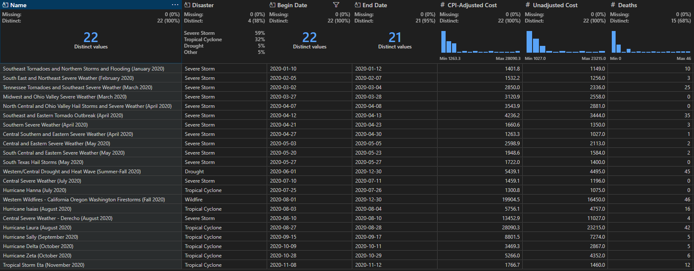
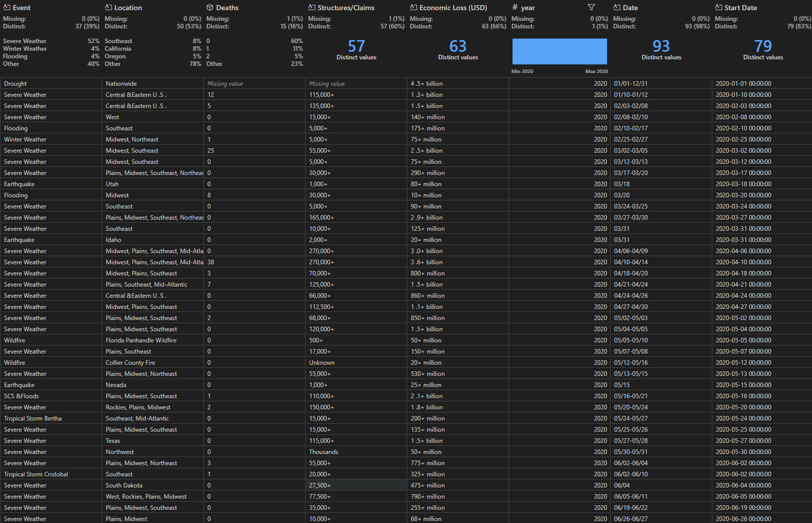

Last year, I [started on a quest](https://aryamik.github.io/posts/Man's%20Search%20for%20Catastrophe%20Data/) for catastrophe modeling. But as I soon found out, I couldn't do anything without getting the data which to no one's surprise was a challenge in itself. After scouring through the internet, downloading data on natural disasters from [Emergency Events Database (EM-DAT)](https://www.emdat.be/) and extracting tables from AON's Weather, Catastrophe and Insight reports; I was able to assemble a 'somewhat reasonable' [dataset](https://github.com/Aryamik/Global-Natural-Disasters-Data) that had information on global natural disasters between 2016-2024 . I want to emphasize somewhat reasonable.

A couple of weeks ago, the amazing folks at University of Zurich's Department of Finance (Schimanski et al. 2026) published a paper [*What Firms Actually Lose (and Gain) from Extreme Weather Event Impacts*](https://papers.ssrn.com/sol3/papers.cfm?abstract_id=6035794) where they used large language models to analyse 1.7 million filings from all publicly listed US firms between 2005-2024 and map identified impacts to 286 specific extreme weather events. They made the data and the models used [publicly available](https://huggingface.co/extreme-weather-impacts). What I was primarily interested in was the [Extreme Event dataset](https://huggingface.co/datasets/extreme-weather-impacts/NOAA_event_with_summary) of the 286 US Specific Weather events that was sourced from NOAA. The dataset contains the following fields:

-   Name: event name according to NOAA

<!-- -->

-   Disaster: disaster event type according to NOAA

<!-- -->

-   Begin Date: event begin date according to NOAA

<!-- -->

-   End Date: event end date according to NOAA

<!-- -->

-   CPI-Adjusted Cost: CPI-adjusted cost of the event according to NOAA

<!-- -->

-   Unadjusted Cost: non-adjusted cost of the event according to NOAA

<!-- -->

-   Deaths: deaths caused by the event according to NOAA

<!-- -->

-   Event Duration: event duration according to NOAA

<!-- -->

-   Event ID: ID of the event in the NOAA billion-dollar dataset

<!-- -->

-   Summary: event description / summary provided by NOAA

As you can probably guess, I was primarily interested in the 'Unadjusted Cost' field. But as I was skimming through the dataset, I looked at some of the events like 'Typhoon Mawar (May 2023)', 'Hurricane Beryl (July 2024)' and these names started to ring a bell. Turns out they were listed in the Appendices of the AON reports. That's when I had a question come up in my head "I wonder if the events listed in this dataset are also included in the AON tables that I extracted?"

Now even without writing a line of code in Python, I could see that the AON dataset only contained values from 2016-2024 whereas the NOAA dataset had events all the way from 2005. But what the AON dataset lacks in terms of breadth, it makes up for it in depth of the events. For the US alone, there were 693 events in the AON dataset and 287 in the NOAA dataset. I should caveat by saying that values for 2017 in my dataset were from EM-DAT as I was having issues extracting values from that year's report. Even then, we can see that the private sector has a leg up in comprehensiveness of the events.

In terms of values, let's examine how they compare. I picked 2020 as a sample year.

In the NOAA dataset, there are 22 distinct events

{width="748"}

In the AON dataset, there are 93 distinct events

{width="716" height="419"}

Let's look at the first event in the NOAA dataset 'Southeast Tornadoes and Northern Storms and Flooding (January 2020)' that took place between 01/10/2020 - 01/12/2020. Now turning towards the AON dataset, we see that is listed as a 'second' event in the dataset and is categorized as 'Severe Weather'. This tells us something about the differences in how the data is recorded across these two sources.

Because I specifically know what I am looking for, I know these two events are the same. The event dates line up so that makes it easier. But if someone else was looking at these values, they would have a hard time manually reconciling the two events. For starters, it looks like NOAA and AON have different approaches for classifying events. How does 'Severe Weather' compare to 'Southeast Tornades and Northern Storms and Flooding'? The latter is definitely more comprehensive. Similarly, the 'Location' column in AON dataset lists that the event occurred in Central and Eastern US whereas the NOAA dataset mentions Southeast and North! The unadjusted cost as per the NOAA dataset for this event was US\$ 1.149 billion. That number somewhat lines up with the US\$ 1.3+ billion value. Again, keyword being 'somewhat'.

Going into this simple exercise, I was under the impression that the private insurance companies would have a leg up when it comes to quantifying and recording extreme weather events. But given the differences in how the data is being categorized, how can one say definitively that one is better than the other? Despite our best efforts at quantifying extreme weather events, there are still limitations at what we can do. If anything, this exercise has made me appreciate the complexities and nuances even more.
